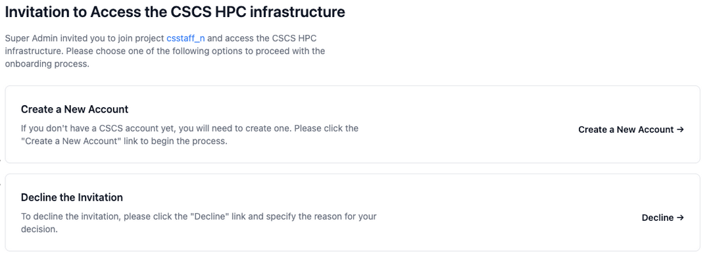
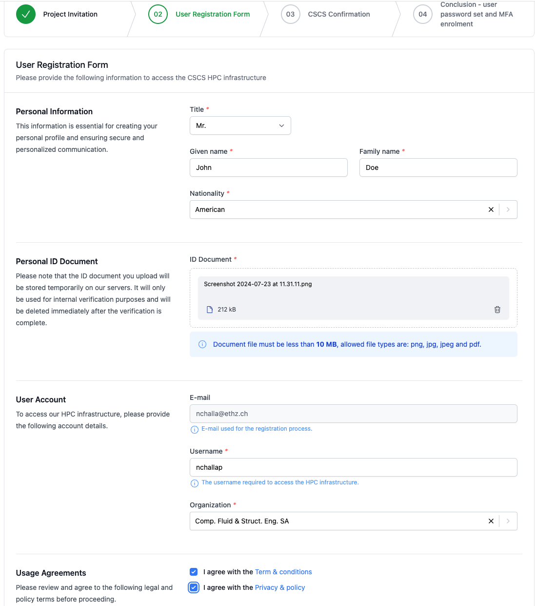
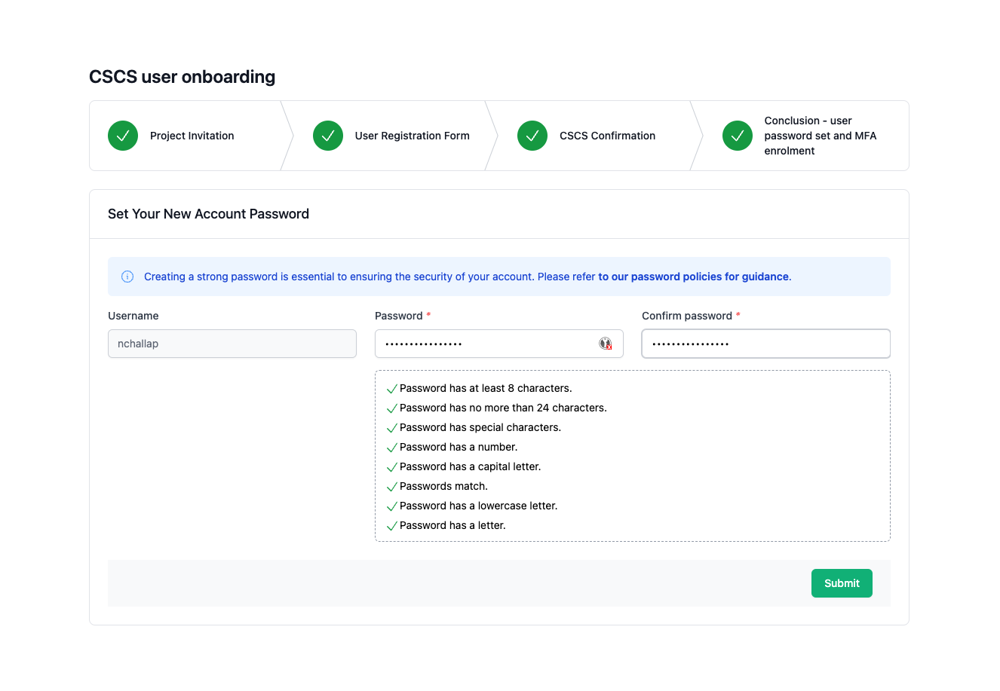
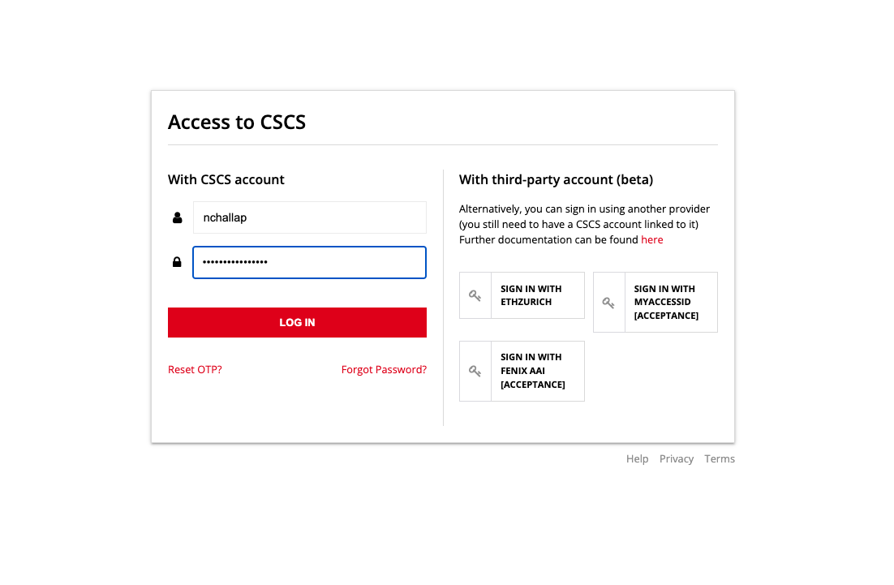
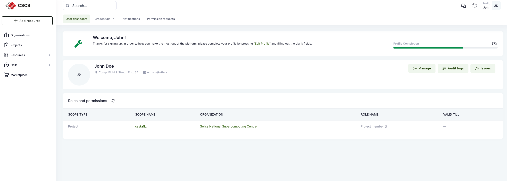

[](){#ref-account-create}
# Creating an account

When the CSCS Account Manager, project PI or Deputy PI invites a user to their project, the user will receive an invitation email. If the invited user has an **existing** CSCS account then the user clicks on the URL from the email and log-in with a username, password, OTP, and accept the invitation. If the invited user is a new user, then the user should follow the step-by-step instructions below to get an account.

The email contains a URL that redirects you to the registration page:



Clicking the "Create a new account" button will lead the user to the second step where he needs to provide his personal information as shown below:



After submitting personal information, users have to wait for CSCS to review and approve the submission.

Once accepted, you will receive an email with a link to set your password.

```title="Acceptance email"
Dear John Doe,

Your username is nchallap.

Please click here to set your password.

Yours sincerely,

CSCS Support Team.
```

Following the link in this email will take you to a page where you set your password.



After your password has been set, you will be redirected to a page where you log in using your username and password



From here you will need to set up [multi-factor authentication][ref-mfa-configure-otp] (MFA).

Once MFA has been configured, you will finally be redirected to the CSCS portal as shown:



[](){#ref-account-create-service-account}
## Requesting a Service Account

Service Accounts are scoped to a **single project** and grant access to all resources within it. To obtain one, the **Project PI** must submit a request to a **Platform Manager** via an [SD Ticket on the Service Desk](https://support.cscs.ch).

### Request Template

To help us process your request efficiently, please include the following information in your SD Ticket:

```
Subject: Service Account Request - [Project Name]

Project: [Your CSCS Project Name]
PI: [Project PI Name]

Service Account Details:
- Account Purpose/Use Case: [e.g., CI/CD pipeline, automated job submission, monitoring, data sync]
- Expected Usage: [Describe what the account will do, frequency, and scale]
- Responsible Team/Person: [Name or team responsible for managing this service account]
- Duration: [e.g., permanent, specific project end date]

Additional Notes: [Any other relevant information, e.g., specific requirements or constraints]
```

### After Approval

Once approved and enabled, the **Service Account** menu entry will appear under the **Team** tab of your Waldur project. For details on setting up and using a Service Account, see [Service Accounts][ref-service-accounts].
