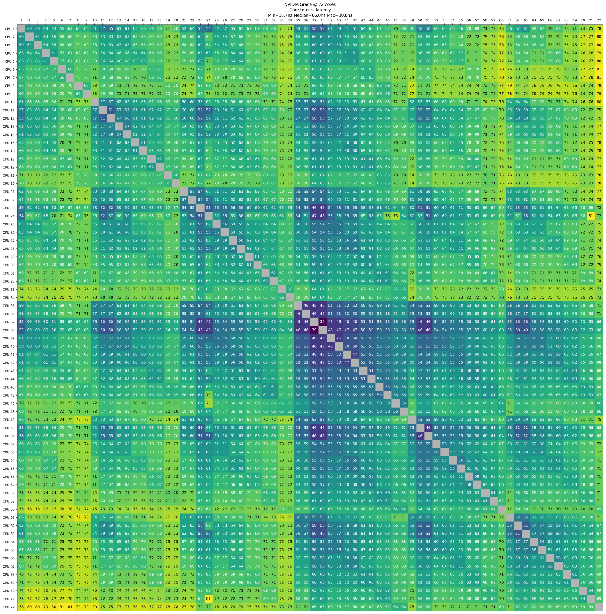
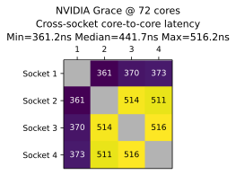

[](){#ref-alps-hardware}
# Alps Hardware

Alps is a HPE Cray EX3000 system, a liquid cooled blade-based, high-density system.

!!! under-construction
    This page is a work in progress - contact us if you want us to prioritise documentation specific information that would be useful for your work.

## Alps Cabinets

The basic building block of the system is a liquid-cooled cabinet.
A single cabinet can accommodate up to 64 compute blade slots within 8 compute chassis. The cabinet is not configured with any
cooling fans.
All cooling needs for the cabinet are provided by direct liquid cooling and the CDU.
This approach to cooling provides greater efficiency for the rack-level cooling, decreases power costs associated with cooling (no blowers) and utilizes a single water source per CDU One cabinet supports the following:

* 8 compute chassis
* 4 power shelves with a maximum of 6 rectifiers per shelf- 24 total 12.5 or 15kW rectifiers per cabinet
* 4 PDUs (1 per power shelf)
* 3 power input whips (3-phase)
* Maximum of 64 quad-blade compute blades
* Maximum of 64 Slingshot switch blades

[](){#ref-alps-hsn}
## Alps High Speed Network

!!! todo
    information about the network.

    * Details about SlingShot 11.
        * how many NICs per node
        * raw feeds and speeds
    * Some OSU benchmark results.
    * GPU-aware communication
    * **slingshot is not infiniband - there is no NVSwitch**

## Alps Nodes

Alps was installed in phases, starting with the installation of 1024 AMD Rome dual socket CPU nodes in 2020, through to the main installation of 2,688 Grace-Hopper nodes in 2024.

There are currently five node types in Alps:

| type                                | abbreviation  | blades | nodes | CPU sockets | GPU devices |
| ----                                | -------       | ------:| -----:| -----------:| -----------:|
| [NVIDIA GH200][ref-alps-gh200-node] | gh200         | 1344   | 2688  | 10,752      | 10,752      |
| [AMD Rome][ref-alps-zen2-node]      | zen2          |  256   | 1024  |  2,048      | --          |
| [NVIDIA A100][ref-alps-a100-node]   | a100          |   72   |  144  |    144      | 576         |
| [AMD MI250x][ref-alps-mi200-node]   | mi200         |   12   |   24  |     24      |  96         |
| [AMD MI300A][ref-alps-mi300-node]   | mi300         |   64   |  128  |    512      | 512         |

[](){#ref-alps-gh200-node}
### NVIDIA GH200 GPU Nodes

!!! under-construction
    The description of the GH200 nodes is a work in progress.
    We will add more detailed information soon.
    Please [get in touch](https://github.com/eth-cscs/cscs-docs/issues) if there is information that you want to see here.

There are 24 cabinets, in 4 rows with 6 cabinets per row, and each cabinet contains 112 nodes (for a total of 448 GH200):

* 8 chassis per cabinet
* 7 blades per chassis
* 2 nodes per blade

!!! info "Why 7 blades per chassis?"
    A chassis can contain up to 8 blades, however Alps' gh200 chassis are underpopulated so that we can increase the amount of power delivered to each GPU without exceeding the power limit of each cabinet.

Each node contains four Grace-Hopper modules and four corresponding network interface cards (NICs) per blade, as illustrated below:


??? info "Node xname"
    There are two boards per blade with one node per board.
    This is different to the `zen2` CPU-only nodes (used for example in Eiger) that have two nodes per board for a total of four nodes per blade.
    As such, there are no `n1` nodes in the xname list, e.g.:
    ```
    x1100c0s6b0n0
    x1100c0s6b1n0
    ```

??? info "Core-to-core latency"
    The core-to-core latency on a Grace CPU (collected using the [`core-to-core-latency`](https://github.com/nviennot/core-to-core-latency) program):

    

    The latencies between the first cores on each of the four Grace CPUs within a node:

    

    Note the significantly higher latencies compared to within a single Grace CPU.

[](){#ref-alps-zen2-node}
### AMD Rome CPU Nodes

These nodes have two [AMD Epyc 7742](https://en.wikichip.org/wiki/amd/epyc/7742) 64-core CPU sockets, and are used primarily for the [Eiger][ref-cluster-eiger] system. They come in two memory configurations:

* *Standard-memory*:  256 GB in 16x16 GB DDR4 DIMMs.
* *Large-memory*:  512 GB in 16x32 GB DDR4 DIMMs.

!!! note "Not all memory is available"
    The total memory available to jobs on the nodes is roughly 245 GB and 497 GB on the standard and large memory nodes respectively.

    The amount of memory available to your job also depends on the number of MPI ranks per node -- each MPI rank has a memory overhead.

A schematic of a *standard memory node* below illustrates the CPU cores and [NUMA nodes](https://www.kernel.org/doc/html/v4.18/vm/numa.html).(1)
{.annotate}

1. Obtained with the command `lstopo --no-caches --no-io --no-legend eiger-topo.png` on Eiger.


* The two sockets are labelled Package L#0 and Package L#1.
* Each socket has 4 NUMA nodes, with 16 cores each, for a total of 64 cores per socket.

Each core supports [simultaneous multi threading (SMT)](https://www.amd.com/en/blogs/2025/simultaneous-multithreading-driving-performance-a.html), whereby each core can execute two threads concurrently, which are presented as two processing units (PU) per physical core:

* the first PU on each core are numbered 0:63 on socket 0, and 64:127 on socket 1;
* the second PU on each core are numbered 128:191 on socket 0, and 192:256 on socket 1;
* hence, core `n` has PUs `n` and `n+128`.

Each node has two Slingshot 11 network interface cards (NICs), which are not illustrated on the diagram.

[](){#ref-alps-a100-node}
### NVIDIA A100 GPU Nodes

The Grizzly Peak blades contain two nodes, where each node has:

* One 64-core Zen3 CPU socket
* 512 GB DDR4 Memory
* 4 NVIDIA A100 GPUs with 80 GB HBM3 memory each
    * The MCH system is the same, except the A100 have 96 GB of memory.
* 4 NICs -- one per GPU.

[](){#ref-alps-mi200-node}
### AMD MI250x GPU Nodes

!!! todo

Bard Peak

[](){#ref-alps-mi300-node}
### AMD MI300A GPU Nodes


!!! todo

Parry Peak
