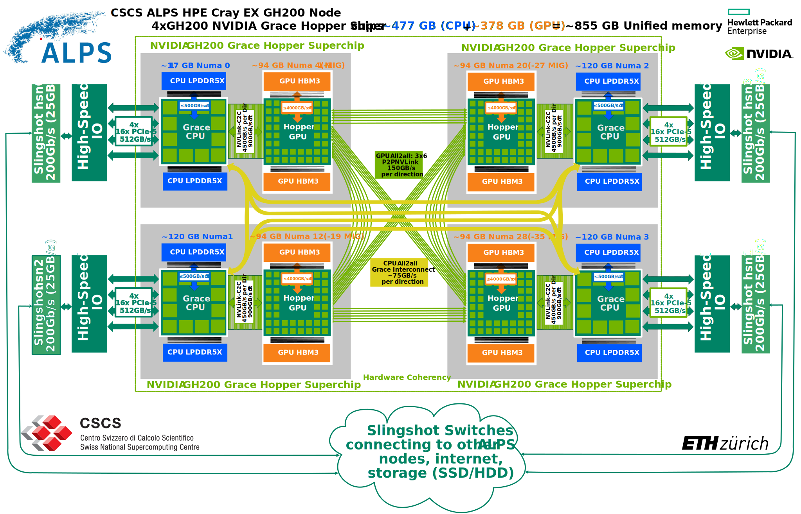

[](){#ref-alps-hardware}
# Alps Hardware

Alps is a HPE Cray EX3000 system, a liquid cooled blade-based, high-density system.

!!! todo
    this is a skeleton - all of the details need to be filled in

## Alps Cabinets

The basic building block of the system is a liquid-cooled cabinet.
A single cabinet can accommodate up to 64 compute blade slots within 8 compute chassis. The cabinet is not configured with any
cooling fans.
All cooling needs for the cabinet are provided by direct liquid cooling and the CDU.
This approach to cooling provides greater efficiency for the rack-level cooling, decreases power costs associated with cooling (no blowers) and utilizes a single water source per CDU One cabinet supports the following:

* 8 compute chassis
* 4 power shelves with a maximum of 6 rectifiers per shelf- 24 total 12.5 or 15kW rectifiers per cabinet
* 4 PDUs (1 per power shelf)
* 3 power input whips (3-phase)
* Maximum of 64 quad-blade compute blades
* Maximum of 64 Slingshot switch blades

[](){#ref-alps-hsn}
## Alps High Speed Network

!!! todo
    information about the network.

    * Details about SlingShot 11.
        * how many NICs per node
        * raw feeds and speeds
    * Some OSU benchmark results.
    * GPU-aware communication
    * **slingshot is not infiniband - there is no NVSwitch**

## Alps Nodes

Alps was installed in phases, starting with the installation of 1024 AMD Rome dual socket CPU nodes in 2020, through to the main installation of 2,688 Grace-Hopper nodes in 2024.

There are currently four node types in Alps, with another becoming available in 2025:

| type           | abbreviation  | blades | nodes | CPU sockets | GPU devices |
| ----           | -------       | ------:| -----:| -----------:| -----------:|
| NVIDIA GH200   | gh200         | 1344   | 2688  | 10,752      | 10,752      |
| AMD Rome       | zen2          |  256   | 1024  |  2,048      | --          |
| NVIDIA A100    | a100          |   72   |  144  |    144      | 576         |
| AMD MI250x     | mi200         |   12   |   24  |     24      |  96         |
| AMD MI300A     | mi300         |   64   |  128  |    512      | 512         |

[](){#ref-alps-gh200-node}
### NVIDIA GH200 GPU Nodes

There are 24 cabinets, in 4 rows with 6 cabinets per row:

* 8 chassis per cabinet
* 7 blades per chassis
    * a chassis can contain up to 8 blades, however Alps' gh200 chassis are underpopulated so that we can increase the amount of power delivered to each node.
* 2 nodes per blade

Each node contains four Grace-Hopper modules and four corresponding network interface cards (NICS) per blade, as illustrated below:



??? info "node xnames"
    There are two boards per blade with one node per board.
    This is different to the `zen2` CPU-only nodes (used for example in Eiger) that had two nodes per board for a total of four nodes per blade.
    As such, there are no `n1` nodes in the xname list, e.g.:
    ```
    x1100c0s6b0n0
    x1100c0s6b1n0
    ```


[](){#ref-alps-zen2-node}
### AMD Rome CPU Nodes

!!! todo

EX425

[](){#ref-alps-a100-node}
### NVIDIA A100 GPU Nodes

!!! todo

Grizzly Peak

[](){#ref-alps-mi200-node}
### AMD MI250x GPU Nodes

!!! todo

Bard Peak

[](){#ref-alps-mi300-node}
### AMD MI300A GPU Nodes

!!! todo

Parry Peak
