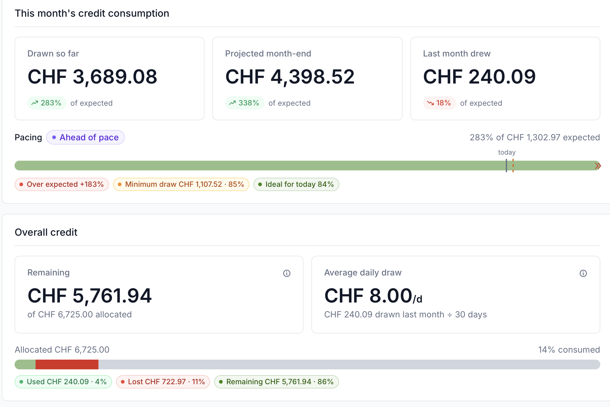

{#ref-mlp-policies}
# Machine Learning Platform project policies

This page describes the policies that govern the lifetime of a project on the [Machine Learning Platform][ref-platform-mlp] (MLP): project types, recorded project data, compute and storage budgets, and the rules for a project's start, duration and end.

These policies are specific to the MLP.
They complement, and where they differ take precedence over, the general [CSCS user policies][ref-policies].
Formulas and worked examples for compute consumption are collected in the [appendix][ref-mlp-policies-appendix].

{#ref-mlp-policies-types}
## Project types

Every MLP project is either small or large depending on the type of proposal submitted (large proposal can be reduced to a small grant instead of being rejected).
The type determines the project's duration and how its start date is set.
The compute budget is only a guideline for which type to apply for.
For more information see the [Swiss AI Initiative Compute Grants](https://www.swiss-ai.org/compute-grants).

| | Small | Large |
| -- | -- | -- |
| Typical compute budget | ≤ 32,000 GPUh | ≳ 500,000 GPUh |
| Duration | 6 months | 12 months |
| Start | [Rolling start][ref-mlp-policies-start-small] | [Fixed start][ref-mlp-policies-start-large] |
| Storage budget | Optional in proposal ([defaults][ref-mlp-policies-storage] apply) | Mandatory in proposal |

{#ref-mlp-policies-project-info}
## Core project data

Recorded for every project at proposal time, and managed through the [project management tool][ref-account-waldur]:

* **Project kind** — small or large.
* **Project ID** — unique identifier.
* **Project title**.
* **Principal investigators (PIs) and deputy PIs** — the project administrators. Only institutional email addresses are accepted; personal addresses (for example generic webmail accounts) cannot be used.
* **Compute budget** — in GPU hours (GPUh), corresponding to a credit in CHF (see [compute budget][ref-mlp-policies-compute]).
* **Storage budget** — space (TB) and inodes (see [storage budget][ref-mlp-policies-storage]).
* **Scientific fields** — the project's research areas.
* **Start date** — fixed for [large projects][ref-mlp-policies-start-large]; derived from the creation date for [small projects][ref-mlp-policies-start-small].
* **Duration** — 6 months (small) or 12 months (large).

{#ref-mlp-policies-compute}
## Compute budget

Your compute budget is granted in GPU hours (GPUh) and corresponds to a credit in CHF according to node-hour [price for swiss institutions](https://2go.cscs.ch/offering/swiss_academia/institutional_customers/) at the start of the project. The cost per hour is fixed for the whole duration of the project (the price can be seen in the resource).
Because a [GH200 node][ref-alps-gh200-node] has four GPUs, one node-hour of a GH200 node costs 4 GPUh.
The jobs that you submit get billed according to the node-hours that they run.

{#ref-mlp-job-cost-example}
!!! note "Job cost example"
    A 3 hours 4-nodes job on Clariden will be billed as 12 node-hours (48 GPUh),
    and with the swiss institutional prices of 2026 (2.69 CHF) means 32.28 CHF

You are expected to use your credit roughly linearly over the project: every month has an expected consumption, the amount you should use that month.
The expected consumption is also used to set your scheduling priority through [Slurm fair-share][ref-policies-fair-use].

* You can consume more than the expected amount without any issue, and only run at lower priority as you get ahead of your schedule.
* Each month also has a minimal consumption — the expected amount reduced by a grace of 15% to 50% (depending on your budget size). If you consume less than expected but stay above this minimal, the unused credit rolls over to the following months, so you can still catch up later. If you fall below the minimal, the credit between your usage and that minimal is lost.

If you use up your credit before the end of the project, you can run extra jobs in the [`low` partition][ref-cluster-clariden].
This is not guaranteed, since jobs run only when the cluster has spare capacity and at lower priority, and it is capped at the equivalent of one month of your budget.
Once that is also exhausted, the project can no longer use compute resources.

<svg viewBox="0 0 1160 320" width="100%" role="img"
     aria-label="Top: three example months of usage as bars against two thresholds, an expected line and a minimal line below it separated by the grace. Above expected is fine, in between rolls over, below the minimal the gap is lost. Bottom: the project timeline, 6 or 12 months, then compute stops, then a 90-day grace period in which the project stays active for data retrieval only, then it closes.">
  <g font-family="Inter, sans-serif">
        <text x="90" y="20" font-size="13" font-weight="600" fill="#888888" letter-spacing="0.6">IN ANY GIVEN MONTH</text>
        <rect x="140" y="52"  width="100" height="128" fill="#9A9AA0"/>
    <rect x="320" y="90"  width="100" height="90"  fill="#9A9AA0"/>
    <rect x="500" y="148" width="100" height="32"  fill="#9A9AA0"/>
        <rect x="500" y="112" width="100" height="36" fill="#F3E0E1" stroke="#D61F26" stroke-width="1.5" stroke-dasharray="4 3"/>
    <text x="550" y="136" font-size="13" font-weight="600" fill="#D61F26" text-anchor="middle">lost</text>
        <line x1="100" y1="70"  x2="800" y2="70"  stroke="#D61F26" stroke-width="2"   stroke-dasharray="7 5"/>
    <line x1="100" y1="112" x2="800" y2="112" stroke="#D61F26" stroke-width="1.5" stroke-dasharray="3 4"/>
    <line x1="100" y1="180" x2="820" y2="180" stroke="#E5E5E5" stroke-width="2"/>
    <text x="810" y="75"  font-size="15" font-weight="600" fill="#D61F26">expected</text>
    <text x="810" y="117" font-size="15" font-weight="600" fill="#D61F26">minimal</text>
        <line x1="990" y1="70" x2="990" y2="112" stroke="#D61F26" stroke-width="1.5"/>
    <line x1="984" y1="70" x2="996" y2="70"  stroke="#D61F26" stroke-width="1.5"/>
    <line x1="984" y1="112" x2="996" y2="112" stroke="#D61F26" stroke-width="1.5"/>
    <text x="1006" y="86"  font-size="13" font-weight="600" fill="#D61F26">grace</text>
    <text x="1006" y="104" font-size="12" fill="#555555">15–50%, by budget size</text>
        <g text-anchor="middle" fill="#1A1A1A">
      <text x="190" y="202" font-size="14" font-weight="600">you go faster</text>
      <text x="190" y="220" font-size="12" fill="#555555">fine — lower priority while ahead</text>
      <text x="370" y="202" font-size="14" font-weight="600">you go slower</text>
      <text x="370" y="220" font-size="12" fill="#555555">the rest rolls over</text>
      <text x="550" y="202" font-size="14" font-weight="600">you fall below</text>
      <text x="550" y="220" font-size="12" fill="#555555">that credit is gone</text>
    </g>
        <line x1="90" y1="240" x2="1140" y2="240" stroke="#F0F0F0" stroke-width="1"/>
    <text x="90" y="262" font-size="13" font-weight="600" fill="#888888" letter-spacing="0.6">OVER THE WHOLE PROJECT</text>
    <line x1="380" y1="288" x2="870" y2="288" stroke="#9A9AA0" stroke-width="5"/>
    <line x1="870" y1="288" x2="1060" y2="288" stroke="#D61F26" stroke-width="5"/>
    <line x1="870" y1="274" x2="870" y2="302" stroke="#1A1A1A" stroke-width="2"/>
    <line x1="1060" y1="278" x2="1060" y2="298" stroke="#1A1A1A" stroke-width="2"/>
    <text x="625" y="310" font-size="13" fill="#555555" text-anchor="middle">6 or 12 months</text>
    <text x="870" y="264" font-size="14" font-weight="600" text-anchor="middle">compute stops</text>
    <text x="965" y="310" font-size="13" font-weight="600" fill="#D61F26" text-anchor="middle">90 days grace — data only</text>
    <text x="1074" y="293" font-size="13" fill="#555555">closes</text>
  </g>
</svg>

The usage for a project can be seen in the project dashboard on [portal.cscs.ch](https://portal.cscs.ch) where you have an overview showing the your usage for current month, and how it is wrt. the expected and ideal usage, and the global credit usage.

Above an example of a project that has been below pace in the past months (and has thus lost some unused credit), but is much ahead of pace for the current month.

See the [appendix][ref-mlp-policies-appendix] for how the expected consumption, the grace and the monthly threshold are computed, with worked examples.

{#ref-mlp-policies-storage}
## Storage budget

The storage budget sets two quotas on [project storage][ref-mlp-storage]: the space (in TB) and the number of inodes (files and directories).

* Small projects need not specify a storage budget; if none is requested, the default of 1 TB and 1,000,000 inodes applies.
* Large projects must specify their storage budget in the proposal, and no default is applied.

CSCS reviews the requested quota and reserves the right to adjust it.
Check current usage against the quota with the [`quota`][ref-storage-quota] command on a login node.

{#ref-mlp-policies-end}
### After the project ends

When a project ends, it remains accessible for a grace period of 90 days for data retrieval: only the [storage systems][ref-mlp-storage] are accessible, and compute resources can no longer be used.

See the general [data retention policies][ref-policies] for how long data is kept and backed up after a project expires.

{#ref-mlp-policies-other}
## Other resources

The main resource for the computation is [Clariden][ref-cluster-clariden], it is the one where we guarantee
availability of the computational resources (if you use them gradually).
Depending on the project you might also access to other resources.

* A project directory as persistent storage (described in the previous section)
* The x86 cluster [Bristen][ref-cluster-bristen]
* [Inference API Service][ref-inference]

Currently storage is not explicitly part of the credit, but the other resources are billed
on your credit, using them reduces the credit and thus the node hours that can be used on
clariden.
Please note that the availability of other resources is not necessarily guaranteed, and
can be limited and on a best effort basis (like bristen).

{#ref-mlp-policies-start}
## Start

How a project's start date is set depends on its type.

{#ref-mlp-policies-start-small}
### Small projects: rolling start

Small projects start in a rolling fashion, as soon as they are accepted.
The effective start date, from which the 6-month duration is counted, defaults to the first day of the following month, and can be delayed by up to 3 months on request of the PI.

The time between creation and the effective start date is a **preparatory period**: the project is already active and usable, but jobs run at low priority, balanced by [Slurm fair-share][ref-policies-fair-use].
The duration and the [compute budget][ref-mlp-policies-compute] only start counting from the effective start date.

!!! example "default and postponed start"
    A small project created on 15 March starts on 1 April by default, and runs until the end of September.
    On request of the PI it may instead start as late as 1 June (within the 3-month limit).
    Until the effective start date the project is usable, but at low priority.

{#ref-mlp-policies-start-large}
### Large projects: fixed start

Large projects start at the scheduled time of the call they were submitted to, normally 1 July or 1 January.
The 12-month duration and the compute budget start counting from that date.

Unlike small projects, a large project has no preparatory period: it is expected to be ready to run at scale from its start date.
For this reason a large allocation is often preceded by a [small project][ref-mlp-policies-start-small], used to get familiar with the systems and prepare the workflows before committing to a large allocation.

{#ref-mlp-policies-duration}
## Duration

* Small projects have a duration of 6 months.
* Large projects have a duration of 12 months.

{#ref-mlp-policies-users}
## Users and job priority

All users of a project have the same priority when running jobs, and there are no per-user limits: any member of a project can draw on the full project budget.

Per-user consumption can be tracked and is available through the [CSCS portal](https://portal.cscs.ch).

{#ref-mlp-policies-appendix}
## Appendix: computing compute consumption

The exact rules behind the [compute budget][ref-mlp-policies-compute]: how the grace, the expected consumption and the monthly minimal threshold are computed, with worked examples.

{#ref-mlp-policies-grace}
### Grace

How far a project is allowed to fall behind the linear schedule is governed by its **grace**, a fixed percentage set once, at allocation time, from the total initial credit:

* credit ≤ 10,000 GPUh gives a grace of 50%,
* credit ≥ 100,000 GPUh gives a grace of 15%,
* between 10,000 and 100,000 GPUh the grace is linearly interpolated between 50% and 15%:

$$
\text{grace} = 50 - 35 \times \frac{\text{credit} - 10{,}000}{90{,}000}\ \%
$$

The grace is fixed for the project's lifetime; larger allocations get a smaller grace, as they are expected to keep the systems more consistently busy.

| Total credit | Grace |
| -- | -- |
| 6,000 GPUh | 50.0% |
| 10,000 GPUh | 50.0% |
| 30,000 GPUh | 42.2% |
| 55,000 GPUh | 32.5% |
| 100,000 GPUh | 15.0% |
| 250,000 GPUh | 15.0% |

{#ref-mlp-policies-monthly-check}
### Expected and minimal consumption

The expected and minimal consumption are recomputed every month, so that credit left unspent in one month can still be used later — up to a point.

At the start of month `m` (with `duration` the project length in months):

* the expected consumption for the month is the amount that should be used to finish the credit at the end of the project plus the amount that has been graced:

    `expected(m) = (credit - consumed(m-1) - graced(m-1))*(m / duration) + graced(m)

* the minimal consumption is a floor below the expected, obtained by allowing a shortfall of at most `grace`:

    `minimal(m) = (1 − grace) × expected(m)`

At the end of the month, let `used` be the credit consumed during the month:

* if `used ≥ minimal(m)`, nothing is lost, and the unspent part of the expected, `graced(m) = max(0, expected(m) − used)`, rolls over and raises next month's expected consumption;
* if `used < minimal(m)`, the shortfall down to the floor, `minimal(m) − used`, is permanently lost (used(m) = minimal), and only the part of the expected above the floor, `graced(m) = expected(m) − minimal(m)`, rolls over.

In both cases the month is accounted for `max(used, minimal(m))` GPUh — the credit consumed, plus any credit forfeited — and this is what the next month's `expected` subtracts.

!!! note "consuming ahead of schedule"
    You can always consume more than the expected amount.
    If a project is already ahead of the linear line, having accounted for more than `target(m)`, then `expected(m)` is zero or negative: there is no minimal to meet for the month, and the project is never penalised for having used its credit early.
    Running ahead of schedule only lowers your scheduling priority through [Slurm fair-share][ref-policies-fair-use], until your consumption falls back in line with the schedule.

!!! example "a small project that keeps up"
    A small project is granted 6,000 GPUh over 6 months.
    Because the credit is below 10,000 GPUh, the grace is 50%.
    Ideal is the perfectly linear consumption

    | Month | Accounted so far | `ideal` | `expected` | `minimal` (50%) |
    | -- | -- | -- | -- | -- |
    | 1 | 0     | 1,000 | 1,000    | 500    |
    | 2 | 750   | 2,000 | 1,250    | 625    |
    | 3 | 2,000 | 3,000 | 1,000    | 500    |

    In month 1 the project uses 750 GPUh, above the 500 GPUh minimal, so nothing is lost.
    It ended the month 250 GPUh behind the line, so in month 2 the expected consumption rises to `2,000 − 750 = 1,250 GPUh` (equivalently `(6,000 − 1,000)/5 + 250`), with a minimal of 625 GPUh.

!!! example "a small project that dips below the minimal consumption"
    Take the same project at the start of month 3, where the expected consumption is 1,000 GPUh and the minimal is 500 GPUh.
    This time it consumes only 200 GPUh during the month, below the 500 GPUh floor.

    * The shortfall down to the floor, `500 − 200 = 300 GPUh`, is permanently lost.
    * The part of the expected above the floor, `1,000 − 500 = 500 GPUh`, rolls over.

    Month 4 therefore starts with an expected consumption of `1,000 + 500 = 1,500 GPUh` and a minimal of 750 GPUh.
