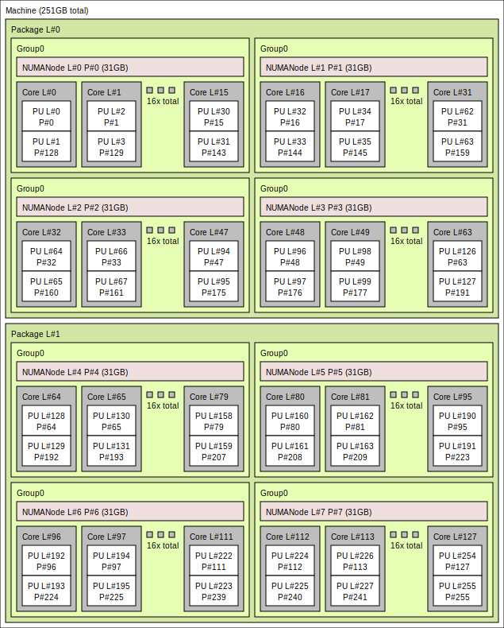

[](){#ref-slurm}
# Slurm

CSCS uses the [Slurm](https://slurm.schedmd.com/documentation.html) workload manager to efficiently schedule and manage jobs on Alps vClusters.
Slurm is an open-source, highly scalable job scheduler that allocates computing resources, queues user jobs, and optimizes workload distribution across the cluster.
It supports advanced scheduling policies, job dependencies, resource reservations, and accounting, making it well-suited for high-performance computing environments.

Refer to the [Quick Start User Guide](https://slurm.schedmd.com/quickstart.html) for commonly used terminology and commands.

<div class="grid cards" markdown>

-   :fontawesome-solid-mountain-sun: __Configuring jobs__

    Specific guidance for configuring Slurm jobs on different node types.

    [:octicons-arrow-right-24: GH200 nodes (Daint, Clariden, Santis)][ref-slurm-gh200]

    [:octicons-arrow-right-24: AMD CPU-only nodes (Eiger)][ref-slurm-amdcpu]

-   :fontawesome-solid-mountain-sun: __Node sharing__

    Guides on how to effectively use all resources on nodes by running more than one job per node.

    [:octicons-arrow-right-24: Node sharing][ref-slurm-sharing]

    [:octicons-arrow-right-24: Multiple MPI jobs per node][ref-slurm-exclusive]

</div>

## Accounts and resources

Slurm associates each job with a CSCS project in order to perform accounting.
The project to use for accounting is specified using the `--account/-A` flag.
If no job is specified, the primary project is used as the default.

??? example "Which projects am I a member of?"
    Users often are part of multiple projects, and by extension their associated `groupd_id` groups.
    You can get a list of your groups using the `id` command in the terminal:
    ```console
    $ id $USER
    uid=12345(bobsmith) gid=32819(g152) groups=32819(g152),33119(g174),32336(vasp6)
    ```
    Here the user `bobsmith` is in three projects (`g152`, `g174` and `vasp6`), with the project `g152` being their **primary project**.

??? example "What is my primary project?"
    In the terminal, use the following command to find your **primary group**:
    ```console
    $ id -gn $USER
    g152
    ```

```console title="Specifying the account on the command line"
$ srun -A g123        -n4 -N1 ./run
$ srun --account=g123 -n4 -N1 ./run
$ sbatch --account=g123 ./job.sh
```

```bash title="Specifying the account in an sbatch script"
#!/bin/bash

#SBATCH --account=g123
#SBATCH --job-name=example-%j
#SBATCH --time=00:30:00
#SBATCH --nodes=4
...
```

!!! note
    The flags `--account` and `-Cmc` that were required on the old [Eiger][ref-cluster-eiger] cluster are no longer required.

## Prioritisation and scheduling

Job priorities are determined based on each project's resource usage relative to its quarterly allocation, as well as in comparison to other projects.
An aging factor is also applied to each job in the queue to ensure fairness over time.

Since users from various projects are continuously submitting jobs, the relative priority of jobs is dynamic and may change frequently.
As a result, estimated start times are approximate and subject to change based on new job submissions.

Additionally, short-duration jobs may be selected for backfilling — a process where the scheduler fills in available time slots while preparing to run a larger, higher-priority job.

[](){#ref-slurm-partitions}
## Partitions

At CSCS, Slurm is configured to accommodate the diverse range of node types available in our HPC clusters.
These nodes vary in architecture, including CPU-only nodes and nodes equipped with different types of GPUs.
Because of this heterogeneity, Slurm must be tailored to ensure efficient resource allocation, job scheduling, and workload management specific to each node type.

Each type of node has different resource constraints and capabilities, which Slurm takes into account when scheduling jobs.
For example, CPU-only nodes may have configurations optimized for multi-threaded CPU workloads, while GPU nodes require additional parameters to allocate GPU resources efficiently.
Slurm ensures that user jobs request and receive the appropriate resources while preventing conflicts or inefficient utilization.

[](){#ref-slurm-partitions-nodecount}
!!! example "How to check the partitions and number of nodes therein?"
    You can check the size of the system by running the following command in the terminal:
    ```console
    $ sinfo --format "| %20R | %10D | %10s | %10l | %10A |"
    | PARTITION            | NODES      | JOB_SIZE   | TIMELIMIT  | NODES(A/I) |
    | debug                | 32         | 1-2        | 30:00      | 3/29       |
    | normal               | 1266       | 1-infinite | 1-00:00:00 | 812/371    |
    | xfer                 | 2          | 1          | 1-00:00:00 | 1/1        |
    ```
    The last column shows the number of nodes that have been allocated in currently running jobs (`A`) and the number of jobs that are idle (`I`).

[](){#ref-slurm-partition-debug}
### Debug partition
The Slurm `debug` partition is useful for quick turnaround workflows. The partition has a short maximum time (timelimit can be seen with `sinfo -p debug`), and a low number of maximum nodes (the `MaxNodes` can be seen with `scontrol show partition=debug`).

[](){#ref-slurm-partition-normal}
### Normal partition
This is the default partition, and will be used when you do not explicitly set a partition.
This is the correct choice for standard jobs. The maximum time is usually set to 24 hours (`sinfo -p normal` for timelimit), and the maximum nodes can be as much as nodes are available.

The following sections will provide detailed guidance on how to use Slurm to request and manage CPU cores, memory, and GPUs in jobs.
These instructions will help users optimize their workload execution and ensure efficient use of CSCS computing resources.

## Interactive jobs
### Single node shell
It is possible to spawn a shell on a compute node to run commands interactively.
This is useful to e.g. compile applications, build container images, etc.
To start an interactive shell on a compute node, you can use the`--pty` flag and execute your shell:
```console title="Single node shell"
$ srun --pty -p debug bash
```
!!! info
    The example above executes the `bash` shell, which is the default shell for most users on Alps.
    It is also possible to execute a different shell, for example `zsh`.
The flag `--pty` allows stdin/stdout interactively.

### Multi node allocation
Sometimes it is useful to first allocate nodes, and then interactively submit jobs to the allocated nodes.
To allocate nodes, you should use the command `salloc`.
```console title="Allocate 2 nodes"
$ salloc -N2 -pdebug
```
This will allocate 2 nodes on the `debug` partition. Now you can run several commands, and they will all run in the same allocation, i.e. they will not go through the SLURM queue.
```console
$ srun -n2 hostname
$ srun -n2 date
$ exit # deallocate the 2 nodes again
```
This will first run the command `hostname` on both nodes, and then it will run as second job the command `date`.
This allows you to quickly iterate without going for every command through the SLURM queue.
Do not forget to `exit` the shell, once you are done, otherwise the allocation will consume your node hours compute budget.
If in doubt, use the commands `squeue --me` to verify if your allocation is still running, and `scancel <JOB-ID>` to cancel the job (i.e. the allocation).

### Connect to node in a running job
It is possible to connect to a node in a running job.
First you will need the `jobid`, which you can find e.g. via `squeue --me`.
To connect to the first node of the job use the command
```console
$ srun --jobid <JOB-ID> --overlap --pty bash
```
This will drop you into a shell on the first compute node of the job.
If you want to connect to a specific node of your job, use additionally the flag `--nodelist=nidXXXXXX`.

## Affinity

The following sections will document how to use Slurm on different compute nodes available on Alps.
To demonstrate the effects different Slurm parameters, we will use a little command line tool [affinity](https://github.com/bcumming/affinity) that prints the CPU cores and GPUs that are assigned to each MPI rank in a job, and which node they are run on.

We strongly recommend using a tool like affinity to understand and test the Slurm configuration for jobs, because the behavior of Slurm is highly dependent on the system configuration.
Parameters that worked on a different cluster---or with a different Slurm version or configuration on the same cluster---are not guaranteed to give the same results.

It is straightforward to build the affinity tool to experiment with Slurm configurations.

```console title="Compiling affinity"
$ uenv start prgenv-gnu/24.11:v2 --view=default     #(1)
$ git clone https://github.com/bcumming/affinity.git
$ cd affinity; mkdir build; cd build;
$ CC=gcc CXX=g++ cmake ..                           #(2)
$ CC=gcc CXX=g++ cmake .. -DAFFINITY_GPU_BACKEND=cuda       #(3)
$ CC=gcc CXX=g++ cmake .. -DAFFINITY_GPU_BACKEND=rocm       #(4)
```

1. Affinity can be built using [`prgenv-gnu`][ref-uenv-prgenv-gnu] on all clusters.

2. By default affinity will build with MPI support and no GPU support: configure with no additional arguments on a CPU-only system like [Eiger][ref-cluster-eiger].

3. Enable CUDA support on systems that provide NVIDIA GPUs.

4. Enable ROCM support on systems that provide AMD GPUs.

The build generates the following executables:

* `affinity.omp`: tests thread affinity with no MPI (always built).
* `affinity.mpi`: tests thread affinity with MPI (built by default).
* `affinity.cuda`: tests thread and GPU affinity with MPI (built with `-DAFFINITY_GPU_BACKEND=cuda`).
* `affinity.rocm`: tests thread and GPU affinity with MPI (built with `-DAFFINITY_GPU_BACKEND=rocm`).

??? example "Testing CPU affinity"
    Test CPU affinity (this can be used on both CPU and GPU enabled nodes).
    ```console
    $ uenv start prgenv-gnu/24.11:v2 --view=default
    $ srun -n8 -N2 -c72 ./affinity.mpi
    affinity test for 8 MPI ranks
    rank   0 @ nid006363: thread 0 -> cores [  0: 71]
    rank   1 @ nid006363: thread 0 -> cores [ 72:143]
    rank   2 @ nid006363: thread 0 -> cores [144:215]
    rank   3 @ nid006363: thread 0 -> cores [216:287]
    rank   4 @ nid006375: thread 0 -> cores [  0: 71]
    rank   5 @ nid006375: thread 0 -> cores [ 72:143]
    rank   6 @ nid006375: thread 0 -> cores [144:215]
    rank   7 @ nid006375: thread 0 -> cores [216:287]
    ```

    In this example there are 8 MPI ranks:

    * ranks `0:3` are on node `nid006363`;
    * ranks `4:7` are on node `nid006375`;
    * each rank has 72 threads numbered `0:71`;
    * all threads on each rank have affinity with the same 72 cores;
    * each rank gets 72 cores, e.g. rank 1 gets cores `72:143` on node `nid006363`.

??? example "Testing GPU affinity"
    Use `affinity.cuda` or `affinity.rocm` to test on GPU-enabled systems.

    ```console
    $ srun -n4 -N1 ./affinity.cuda                      #(1)
    GPU affinity test for 4 MPI ranks
    rank      0 @ nid005555
     cores   : [0:7]
     gpu   0 : GPU-2ae325c4-b542-26c2-d10f-c4d84847f461
     gpu   1 : GPU-5923dec6-288f-4418-f485-666b93f5f244
     gpu   2 : GPU-170b8198-a3e1-de6a-ff82-d440f71c05da
     gpu   3 : GPU-0e184efb-1d1f-f278-b96d-15bc8e5f17be
    rank      1 @ nid005555
     cores   : [72:79]
     gpu   0 : GPU-2ae325c4-b542-26c2-d10f-c4d84847f461
     gpu   1 : GPU-5923dec6-288f-4418-f485-666b93f5f244
     gpu   2 : GPU-170b8198-a3e1-de6a-ff82-d440f71c05da
     gpu   3 : GPU-0e184efb-1d1f-f278-b96d-15bc8e5f17be
    rank      2 @ nid005555
     cores   : [144:151]
     gpu   0 : GPU-2ae325c4-b542-26c2-d10f-c4d84847f461
     gpu   1 : GPU-5923dec6-288f-4418-f485-666b93f5f244
     gpu   2 : GPU-170b8198-a3e1-de6a-ff82-d440f71c05da
     gpu   3 : GPU-0e184efb-1d1f-f278-b96d-15bc8e5f17be
    rank      3 @ nid005555
     cores   : [216:223]
     gpu   0 : GPU-2ae325c4-b542-26c2-d10f-c4d84847f461
     gpu   1 : GPU-5923dec6-288f-4418-f485-666b93f5f244
     gpu   2 : GPU-170b8198-a3e1-de6a-ff82-d440f71c05da
     gpu   3 : GPU-0e184efb-1d1f-f278-b96d-15bc8e5f17be
    $ srun -n4 -N1 --gpus-per-task=1 ./affinity.cuda    #(2)
    GPU affinity test for 4 MPI ranks
    rank      0 @ nid005675
     cores   : [0:7]
     gpu   0 : GPU-a16a8dac-7661-a44b-c6f8-f783f6e812d3
    rank      1 @ nid005675
     cores   : [72:79]
     gpu   0 : GPU-ca5160ac-2c1e-ff6c-9cec-e7ce5c9b2d09
    rank      2 @ nid005675
     cores   : [144:151]
     gpu   0 : GPU-496a2216-8b3c-878e-e317-36e69af11161
    rank      3 @ nid005675
     cores   : [216:223]
     gpu   0 : GPU-766e3b8b-fa19-1480-b02f-0dfd3f2c87ff
    ```

    1. Test GPU affinity: note how all 4 ranks see the same 4 GPUs.

    2. Test GPU affinity: note how the `--gpus-per-task=1` parameter assigns a unique GPU to each rank.

!!! info "Quick affinity checks"

    The Slurm flag [`--cpu-bind=verbose`](https://slurm.schedmd.com/srun.html#OPT_cpu-bind) prints information about MPI ranks and their thread affinity.

    The mask it prints is not very readable, but it can be used with the `true` command to quickly test Slurm parameters without building the Affinity tool.

    ```console title="hello"
    $ srun --cpu-bind=verbose -c32 -n4 -N1 --hint=nomultithread -- true
    cpu-bind=MASK - nid002156, task  0  0 [147694]: mask 0xffffffff set
    cpu-bind=MASK - nid002156, task  1  1 [147695]: mask 0xffffffff0000000000000000 set
    cpu-bind=MASK - nid002156, task  2  2 [147696]: mask 0xffffffff00000000 set
    cpu-bind=MASK - nid002156, task  3  3 [147697]: mask 0xffffffff000000000000000000000000 set
    ```

    You can also check GPU affinity by inspecting the value of the `CUDA_VISIBLE_DEVICES` environment variable.

[](){#ref-slurm-features}
## Slurm features

Slurm allows specifying [constraints](https://slurm.schedmd.com/sbatch.html#OPT_constraint) for jobs, which can be used to change features available on nodes in a job.
CSCS implements a few custom features, described below, that can be selected on certain clusters.
To check which features are available on a cluster, for example on the `normal` partition, use `sinfo`:

```console
$ sinfo --partition normal --format %b
ACTIVE_FEATURES
gh,gpu,thp_never,thp_always,thp_madvise,nvidia_vboost_enabled,nvidia_vboost_disabled
```

One or more constraints can be selected using the `--constraint`/`-C` flag of `sbatch` or `srun`:

```bash
sbatch --constraint thp_never&nvidia_vboost_enabled batch.sh
```

[](){#ref-slurm-features-thp}
### Transparent hugepages

!!! info "The THP Slurm feature is only available on [GH200 nodes][ref-alps-gh200-node]"

[Transparent hugepages (THP)](https://www.kernel.org/doc/html/v6.17/admin-guide/mm/transhuge.html) are a Linux kernel feature that allows automatically coalescing pages into huge pages without the user application explicitly asking for hugepages:

> Performance critical computing applications dealing with large memory working sets are already running on top of libhugetlbfs and in turn hugetlbfs.
> Transparent HugePage Support (THP) is an alternative mean of using huge pages for the backing of virtual memory with huge pages that supports the automatic promotion and demotion of page sizes and without the shortcomings of hugetlbfs.

While this feature generally improves performance, we have observed degrading application performance with the THP feature enabled due to the page coalescing blocking progress on certain operations.
An example of this is ICON, a latency-sensitive application where small delays can can cause large performance drops.

THP support is enabled by default, and the current setting can be checked with:

```console
$ cat /sys/kernel/mm/transparent_hugepage/enabled
[always] madvise never
```

A detailed explanation of how the different options behave can be found in the [THP documentation](https://www.kernel.org/doc/html/v6.17/admin-guide/mm/transhuge.html#global-thp-controls).

The available Slurm features to select the THP mode are listed below:

| Kernel setting | Slurm constraint       |
|----------------|------------------------|
| `always`       | `thp_always` (default) |
| `madvise`      | `thp_madvise`          |
| `never`        | `thp_never`            |

[](){#ref-slurm-features-vboost}
### NVIDIA vboost

!!! info "The NVIDIA vboost Slurm feature is only available on [GH200 nodes][ref-alps-gh200-node]"

The [NVIDIA NeMo documentation](https://docs.nvidia.com/nemo-framework/user-guide/latest/performance/performance-guide.html#gpu-core-clock-optimization) describes the vboost feature as:

> NVIDIA GPUs support a CPU core clock boost mode, which increases the core clock rate by reducing the off-chip memory clock rate.
> This is particularly beneficial for LLMs, which are typically compute throughput-bound.

The vboost slider is at `0` by default, and the current value can be checked checked with `nvidia-smi`:

```console
$ nvidia-smi boost-slider --list
+-------------------------------------------------+
| GPU Boost Slider                                |
| GPU     Slider       Max Value    Current Value |
|=================================================|
|   0     vboost           4              0       |
+-------------------------------------------------+
|   1     vboost           4              0       |
+-------------------------------------------------+
|   2     vboost           4              0       |
+-------------------------------------------------+
|   3     vboost           4              0       |
+-------------------------------------------------+
```

The slider can be set to `1` using the `nvidia_vboost_enable` feature:

| vboost setting | Slurm constraint                  |
|----------------|-----------------------------------|
| `0`            | `nvidia_vboost_disable` (default) |
| `1`            | `nvidia_vboost_enable`            |

[](){#ref-slurm-gh200}
## NVIDIA GH200 GPU Nodes

The [GH200 nodes on Alps][ref-alps-gh200-node] have four GPUs per node, and Slurm job submissions must be configured appropriately to best make use of the resources.
Applications that can saturate the GPUs with a single process per GPU should generally prefer this mode.
[Configuring Slurm jobs to use a single GPU per rank][ref-slurm-gh200-single-rank-per-gpu] is also the most straightforward setup.
Some applications perform badly with a single rank per GPU, and require use of [NVIDIA's Multi-Process Service (MPS)] to oversubscribe GPUs with multiple ranks per GPU.

The best Slurm configuration is application- and workload-specific, so it is worth testing which works best in your particular case.
See [Scientific Applications][ref-software-sciapps] for information about recommended application-specific Slurm configurations.

!!! warning
    The GH200 nodes have their GPUs configured in ["default" compute mode](https://docs.nvidia.com/deploy/mps/index.html#gpu-compute-modes).
    The "default" mode is used to avoid issues with certain containers.
    Unlike "exclusive process" mode, "default" mode allows multiple processes to submit work to a single GPU simultaneously.
    This also means that different ranks on the same node can inadvertently use the same GPU leading to suboptimal performance or unused GPUs, rather than job failures.

    Some applications benefit from using multiple ranks per GPU. However, [MPS should be used][ref-slurm-gh200-multi-rank-per-gpu] in these cases.

    If you are unsure about which GPU is being used for a particular rank, print the `CUDA_VISIBLE_DEVICES` variable, along with e.g. `SLURM_LOCALID`, `SLURM_PROCID`, and `SLURM_NODEID` variables, in your job script.
    If the variable is unset or empty all GPUs are visible to the rank and the rank will in most cases only use the first GPU.

[](){#ref-slurm-gh200-single-rank-per-gpu}
### One rank per GPU

Configuring Slurm to use one GH200 GPU per rank is easiest done using the `--ntasks-per-node=4` and `--gpus-per-task=1` Slurm flags.
For advanced users, using `--gpus-per-task` is equivalent to setting `CUDA_VISIBLE_DEVICES` to `SLURM_LOCALID`, assuming the job is using four ranks per node.
The examples below launch jobs on two nodes with four ranks per node using `sbatch` and `srun`:

```bash
#!/bin/bash
#SBATCH --job-name=gh200-single-rank-per-gpu
#SBATCH --nodes=2
#SBATCH --ntasks-per-node=4
#SBATCH --gpus-per-task=1

srun <application>
```

Omitting the `--gpus-per-task` results in `CUDA_VISIBLE_DEVICES` being unset, which will lead to most applications using the first GPU on all ranks.

[](){#ref-slurm-gh200-multi-rank-per-gpu}
### Multiple ranks per GPU

Using multiple ranks per GPU can improve performance e.g. of applications that don't generate enough work for a GPU using a single rank, or ones that scale badly to all 72 cores of the Grace CPU.
In these cases Slurm jobs must be configured to assign multiple ranks to a single GPU.
This is best done using [NVIDIA's Multi-Process Service (MPS)].
To use MPS, launch your application using the following wrapper script, which will start MPS on one rank per node and assign GPUs to ranks according to the CPU mask of a rank, ensuring the closest GPU is used:

```bash title="mps-wrapper.sh"
#!/bin/bash
# Example mps-wrapper.sh usage:
# > srun [srun args] mps-wrapper.sh [cmd] [cmd args]

# Only this path is supported by MPS
export CUDA_MPS_PIPE_DIRECTORY=/tmp/nvidia-mps
export CUDA_MPS_LOG_DIRECTORY=/tmp/nvidia-log-$(id -un)

# Launch MPS from a single rank per node
if [[ $SLURM_LOCALID -eq 0 ]]; then
    CUDA_VISIBLE_DEVICES=0,1,2,3 nvidia-cuda-mps-control -d
fi

# Set CUDA device. Disable HWLOC_KEEP_NVIDIA_GPU_NUMA_NODES to avoid GPU NUMA
# nodes appearing in the list of CUDA devices. They start appearing in hwloc
# version 2.11.
numa_nodes=$(HWLOC_KEEP_NVIDIA_GPU_NUMA_NODES=0 hwloc-calc --physical --intersect NUMAnode $(hwloc-bind --get --taskset))
export CUDA_VISIBLE_DEVICES=$numa_nodes

# Wait for MPS to start
sleep 1

# Run the command
numactl --membind=$numa_nodes "$@"
result=$?

# Quit MPS control daemon before exiting
if [[ $SLURM_LOCALID -eq 0 ]]; then
    echo quit | nvidia-cuda-mps-control
fi

exit $result
```

Save the above script as `mps-wrapper.sh` and make it executable with `chmod +x mps-wrapper.sh`.
If the `mps-wrapper.sh` script is in the current working directory, you can then launch jobs using MPS for example as follows:

```bash
#!/bin/bash
#SBATCH --job-name=gh200-multiple-ranks-per-gpu
#SBATCH --nodes=2
#SBATCH --ntasks-per-node=32
#SBATCH --cpus-per-task=8

srun ./mps-wrapper.sh <application>
```

Note that in the example job above:

- `--gpus-per-node` is not set at all; the `mps-wrapper.sh` script ensures that the right GPU is visible for each rank using `CUDA_VISIBLE_DEVICES`
- `--ntasks-per-node` is set to 32; this results in 8 ranks per GPU
- `--cpus-per-task` is set to 8; this ensures that threads are not allowed to migrate across the whole GH200 node

The configuration that is optimal for your application may be different.

[NVIDIA's Multi-Process Service (MPS)]: https://docs.nvidia.com/deploy/mps/index.html

[](){#ref-slurm-amdcpu}
## AMD CPU nodes

Alps has nodes with two AMD Epyc Rome CPU sockets per node for CPU-only workloads, most notably in the [Eiger][ref-cluster-eiger] cluster provided by the [HPC Platform][ref-platform-hpcp].
For a detailed description of the node hardware, see the [AMD Rome node][ref-alps-zen2-node] hardware documentation.

??? info "Node description"
    - The node has 2 x 64 core sockets
    - Each socket is divided into 4 NUMA regions
        - the 16 cores in each NUMA region have faster memory access to their of 32 GB
    - Each core has two processing units (PUs)

    


Each MPI rank is assigned a set of cores on a node, and Slurm provides flags that can be used directly as flags to `srun`, or as arguments in an `sbatch` script.
Here are some basic flags that we will use to distribute work.

| flag  | meaning |
| ----  | ------- |
| `-n`, `--ntasks`    |  The total number of MPI ranks |
| `-N`, `--nodes`     |  The total number of nodes |
| `--ntasks-per-node` |  The total number of nodes |
| `-c`, `--cpus-per-task` |  The number of cores to assign to each rank. |
| `--hint=nomultithread`  |  Use only one PU per core |

!!! info "Slurm is highly configurable"
    These are a subset of the most useful flags.
    Call `srun --help` or `sbatch --help` to get a complete list of all the flags available on your target cluster.
    Note that the exact set of flags available depends on the Slurm version, how Slurm was configured, and Slurm plugins.

The first example assigns 2 MPI ranks per node, with 64 cores per rank, with the two PUs per core:
```console title="One MPI rank per socket"
# one node
$ srun -n2 -N1 -c64 ./affinity.mpi
affinity test for 2 MPI ranks
rank   0 @ nid002199: thread 0 -> cores [  0: 31,128:159]
rank   1 @ nid002199: thread 0 -> cores [ 64: 95,192:223]

# two nodes
$ srun -n4 -N2 -c64 ./affinity.mpi
affinity test for 4 MPI ranks
rank   0 @ nid001512: thread 0 -> cores [  0: 31,128:159]
rank   1 @ nid001512: thread 0 -> cores [ 64: 95,192:223]
rank   2 @ nid001515: thread 0 -> cores [  0: 31,128:159]
rank   3 @ nid001515: thread 0 -> cores [ 64: 95,192:223]
```

!!! note
    In the above example we use `--ntasks/-n` and `--nodes/-N`.
    It is possible to achieve the same effect using `--nodes` and `--ntasks-per-node`, for example the following both give 8 ranks on 4 nodes:

    ```bash
    srun --nodes=4 --ntasks=8
    srun --nodes=4 --ntasks-per-node=2
    ```

It is often more efficient to only run one task per core instead of the default two PU, which can be achieved using the `--hint=nomultithread` option.
```console title="One MPI rank per socket with 1 PU per core"
$ srun -n2 -N1 -c64 --hint=nomultithread ./affinity.mpi
affinity test for 2 MPI ranks
rank   0 @ nid002199: thread 0 -> cores [  0: 63]
rank   1 @ nid002199: thread 0 -> cores [ 64:127]
```

!!! note "Always test"
    The best configuration for performance is highly application specific, with no one-size-fits-all configuration.
    Take the time to experiment with `--hint=nomultithread`.

Memory on the node is divided into NUMA (non-uniform memory access) regions.
The 256 GB of a standard-memory node are divided into 8 NUMA nodes of 32 GB, with 16 cores associated with each node:

* memory access is optimal when all the cores of a rank are on the same NUMA node;
* memory access to NUMA regions on the other socket are significantly slower.

??? info "How to investigate the NUMA layout of a node"
    Use the command `numactl -H`.

    ```console
    $ srun -n1 numactl -H
    available: 8 nodes (0-7)
    node 0 cpus: 0 1 2 3 4 5 6 7 8 9 10 11 12 13 14 15 128 129 130 131 132 133 134 135 136 137 138 139 140 141 142 143
    node 0 size: 63733 MB
    node 0 free: 62780 MB
    node 1 cpus: 16 17 18 19 20 21 22 23 24 25 26 27 28 29 30 31 144 145 146 147 148 149 150 151 152 153 154 155 156 157 158 159
    node 1 size: 64502 MB
    node 1 free: 61774 MB
    node 2 cpus: 32 33 34 35 36 37 38 39 40 41 42 43 44 45 46 47 160 161 162 163 164 165 166 167 168 169 170 171 172 173 174 175
    node 2 size: 64456 MB
    node 2 free: 63385 MB
    node 3 cpus: 48 49 50 51 52 53 54 55 56 57 58 59 60 61 62 63 176 177 178 179 180 181 182 183 184 185 186 187 188 189 190 191
    node 3 size: 64490 MB
    node 3 free: 62613 MB
    node 4 cpus: 64 65 66 67 68 69 70 71 72 73 74 75 76 77 78 79 192 193 194 195 196 197 198 199 200 201 202 203 204 205 206 207
    node 4 size: 64502 MB
    node 4 free: 63897 MB
    node 5 cpus: 80 81 82 83 84 85 86 87 88 89 90 91 92 93 94 95 208 209 210 211 212 213 214 215 216 217 218 219 220 221 222 223
    node 5 size: 64502 MB
    node 5 free: 63769 MB
    node 6 cpus: 96 97 98 99 100 101 102 103 104 105 106 107 108 109 110 111 224 225 226 227 228 229 230 231 232 233 234 235 236 237 238 239
    node 6 size: 64502 MB
    node 6 free: 63870 MB
    node 7 cpus: 112 113 114 115 116 117 118 119 120 121 122 123 124 125 126 127 240 241 242 243 244 245 246 247 248 249 250 251 252 253 254 255
    node 7 size: 64428 MB
    node 7 free: 63712 MB
    node distances:
    node   0   1   2   3   4   5   6   7
      0:  10  12  12  12  32  32  32  32
      1:  12  10  12  12  32  32  32  32
      2:  12  12  10  12  32  32  32  32
      3:  12  12  12  10  32  32  32  32
      4:  32  32  32  32  10  12  12  12
      5:  32  32  32  32  12  10  12  12
      6:  32  32  32  32  12  12  10  12
      7:  32  32  32  32  12  12  12  10
    ```
    The `node distances` table shows that the cores have the fastest memory access to memory in their own region (`10`), and fast access (`12`) to NUMA regions on the same socket.
    The cost of accessing memory of a NUMA node on the other socket is much higher (`32`).

    Note that this command was run on a large-memory node that has 8 x 64 GB NUMA regions, for a total of 512 GB.

The examples above placed one rank per socket, which is not optimal for NUMA access, because cores assigned to each rank are spread over the 4 NUMA nodes on the socket.
To constrain tasks to NUMA nodes, use 16 cores per task:


```console title="One MPI rank per NUMA region"
$ srun -n8 -N1 -c16 --hint=nomultithread ./affinity.mpi
affinity test for 8 MPI ranks
rank   0 @ nid002199: thread 0 -> cores [  0: 15]
rank   1 @ nid002199: thread 0 -> cores [ 64: 79]
rank   2 @ nid002199: thread 0 -> cores [ 16: 31]
rank   3 @ nid002199: thread 0 -> cores [ 80: 95]
rank   4 @ nid002199: thread 0 -> cores [ 32: 47]
rank   5 @ nid002199: thread 0 -> cores [ 96:111]
rank   6 @ nid002199: thread 0 -> cores [ 48: 63]
rank   7 @ nid002199: thread 0 -> cores [112:127]
```

!!! Note "Always test"
    It might still be optimal for applications that have high threading efficiency and benefit from using fewer MPI ranks to have one rank per socket or even one one rank per node.
    Always test!

### OpenMP

In the above examples all threads on each---we are effectively allowing the OS to schedule the threads on the available set of cores as it sees fit.
This often gives the best performance, however sometimes it is beneficial to bind threads to explicit cores.

The OpenMP threading runtime provides additional options for controlling the pinning of threads to the cores assigned to each MPI rank.

Use the `--omp` flag with `affinity.mpi` to get more detailed information about OpenMP thread affinity.
For example, four MPI ranks on one node with four cores and four OpenMP threads:

```console title="No OpenMP binding"
$ export OMP_NUM_THREADS=4
$ srun -n4 -N1 -c4 --hint=nomultithread ./affinity.mpi --omp
affinity test for 4 MPI ranks
rank   0 @ nid001512: threads [0:3] -> cores [  0:  3]
rank   1 @ nid001512: threads [0:3] -> cores [ 64: 67]
rank   2 @ nid001512: threads [0:3] -> cores [  4:  7]
rank   3 @ nid001512: threads [0:3] -> cores [ 68: 71]
```

The status `threads [0:3] -> cores [  0:  3]` is shorthand "there are 4 OpenMP threads, and the OS can schedule them on cores 0, 1, 2 and 3".

Allowing the OS to schedule threads is usually efficient, however to get the most you can try pinning threads to specific cores.
The [`OMP_PROC_BIND`](https://www.openmp.org/spec-html/5.0/openmpse52.html) environment variable can be used to tune how OpenMP sets thread affinity.
For example, `OMO_PROC_BIND=true` will give each thread exclusive affinity with a core:

```console title="OMP_PROC_BIND=true"
$ export OMP_NUM_THREADS=4
$ export OMP_PROC_BIND=true
$ srun -n4 -N1 -c4 --hint=nomultithread ./affinity.mpi --omp
affinity test for 4 MPI ranks
rank   0 @ nid001512
  thread 0 -> core   0
  thread 1 -> core   1
  thread 2 -> core   2
  thread 3 -> core   3
rank   1 @ nid001512
  thread 0 -> core  64
  thread 1 -> core  65
  thread 2 -> core  66
  thread 3 -> core  67
rank   2 @ nid001512
  thread 0 -> core   4
  thread 1 -> core   5
  thread 2 -> core   6
  thread 3 -> core   7
rank   3 @ nid001512
  thread 0 -> core  68
  thread 1 -> core  69
  thread 2 -> core  70
  thread 3 -> core  71
```

!!! note
    There are many OpenMP variables that can be used to fine tune affinity.
    See the [OpenMP documentation](https://www.openmp.org/spec-html/5.0/openmpch6.html) for more information.

!!! warning
    The `OMP_*` environment variables only affect thread affinity of applications that use OpenMP for thread-level parallelism.
    Other threading runtimes will be configured differently, and the `affinity.mpi` tool will only be able to show the set of cores assigned to the rank.

[](){#ref-slurm-over-subscription}
## Node over-subscription

The nodes on Alps provide a lot of resources, particularly the GPU nodes that have 4 GPUs.
For workflows and use cases with tasks that require only a subset of these resources, for example a simulation that only needs one GPU, allocating a whole node to run one task is a waste of resources.

!!! example
    A workflow that runs a single [GROMACS][ref-uenv-gromacs] simulation, that uses one GPU.

    * The optimal use of resources would allocate one quarter of a node, and allow other jobs to access the other three GPUs.

    A workflow that runs 100 independent [GROMACS][ref-uenv-gromacs] simulations, where each simulation requires two GPUs.

    * The optimal use of resources would allocate 50 nodes, with two simulations run on each node.

[](){#ref-slurm-sharing}
### Node sharing

!!! under-construction
    Node sharing, whereby jobs can request part of the resources on a node, and multiple jobs can run on a node (possibly from different users) is _not currently available on Alps clusters_.

    CSCS will support this feature on some Alps [clusters][ref-alps-clusters] in the near-medium future.

[](){#ref-slurm-exclusive}
### Running more than one job step per node

Running multiple job steps in parallel on the same allocated set of nodes can improve resource utilization by taking advantage of all the available CPUs, GPUs, or memory within a single job allocation.

The approach is to:

1. first allocate all the resources on each node to the job;
2. then subdivide those resources at each invocation of srun.

If Slurm believes that a request for resources (cores, GPUs, memory) overlaps with what another step has already allocated, it will defer the execution until the resources are relinquished.
This must be avoided.

First ensure that *all* resources are allocated to the whole job with the following preamble:

```bash title="Slurm preamble on a GH200 node"
#!/usr/bin/env bash
#SBATCH --exclusive --mem=450G
```

* `--exclusive` allocates all the CPUs and GPUs exclusively to this job;
* `--mem=450G` most of allowable memory (there are 4 Grace CPUs with ~120 GB of memory on the node)

!!! note
    `--mem=0` can generally be used to allocate all memory on the node but the Slurm configuration on clariden doesn't allow this.

Next, launch your applications using `srun`, carefully subdividing resources for each job step.
The `--exclusive` flag must be used again, but note that its meaning differs in the context of `srun`.
Here, `--exclusive` ensures that only the resources explicitly requested for a given job step are reserved and allocated to it.
Without this flag, Slurm reserves all resources for the job step, even if it only allocates a subset---effectively blocking further parallel `srun` invocations from accessing unrequested but needed resources.

Be sure to background each `srun` command with `&`, so that subsequent job steps start immediately without waiting for previous ones to finish.
A final `wait` command ensures that your submission script does not exit until all job steps complete.

Slurm will automatically set `CUDA_VISIBLE_DEVICES` for each `srun` call, restricting GPU access to only the devices assigned to that job step.

=== "single node"

    !!! example "Three jobs on one node"
        ```bash
        #!/usr/bin/env bash
        #SBATCH --exclusive --mem=450G
        #SBATCH -N1

        CMD="echo \$(date) \$(hostname) JobStep:\${SLURM_STEP_ID} ProcID:\${SLURM_PROCID} CUDA_VISIBLE_DEVICES=\${CUDA_VISIBLE_DEVICES}; sleep 5"
        srun -N1 --ntasks-per-node=1 --exclusive --gpus-per-task=2 --cpus-per-gpu=5 --mem=50G --output "out-%J.log"  bash -c "${CMD}" &
        srun -N1 --ntasks-per-node=1 --exclusive --gpus-per-task=1 --cpus-per-gpu=5 --mem=50G --output "out-%J.log"  bash -c "${CMD}" &
        srun -N1 --ntasks-per-node=1 --exclusive --gpus-per-task=1 --cpus-per-gpu=5 --mem=50G --output "out-%J.log"  bash -c "${CMD}" &

        wait
        ```

        Output (exact output will vary):
        ```
        $ cat out-537506.*.log
        Tue Jul 1 11:40:46 CEST 2025 nid007104 JobStep:0 ProcID:0 CUDA_VISIBLE_DEVICES=0
        Tue Jul 1 11:40:46 CEST 2025 nid007104 JobStep:1 ProcID:0 CUDA_VISIBLE_DEVICES=1
        Tue Jul 1 11:40:46 CEST 2025 nid007104 JobStep:2 ProcID:0 CUDA_VISIBLE_DEVICES=2,3
        ```


=== "multi-node"

    !!! example "Three jobs on two nodes"
        ```bash
        #!/usr/bin/env bash
        #SBATCH --exclusive --mem=450G
        #SBATCH -N2

        CMD="echo \$(date) \$(hostname) JobStep:\${SLURM_STEP_ID} ProcID:\${SLURM_PROCID} CUDA_VISIBLE_DEVICES=\${CUDA_VISIBLE_DEVICES}; sleep 5"
        srun -N2 --ntasks-per-node=2 --exclusive --gpus-per-task=1 --cpus-per-gpu=5 --mem=50G --output "out-%J.log"  bash -c "${CMD}" &
        srun -N2 --ntasks-per-node=1 --exclusive --gpus-per-task=1 --cpus-per-gpu=5 --mem=50G --output "out-%J.log"  bash -c "${CMD}" &
        srun -N2 --ntasks-per-node=1 --exclusive --gpus-per-task=1 --cpus-per-gpu=5 --mem=50G --output "out-%J.log"  bash -c "${CMD}" &

        wait
        ```

        Output (exact output will vary):
        ```
        $ cat out-537539.*.log
        Tue Jul 1 12:02:01 CEST 2025 nid005085 JobStep:0 ProcID:2 CUDA_VISIBLE_DEVICES=0
        Tue Jul 1 12:02:01 CEST 2025 nid005085 JobStep:0 ProcID:3 CUDA_VISIBLE_DEVICES=1
        Tue Jul 1 12:02:01 CEST 2025 nid005080 JobStep:0 ProcID:0 CUDA_VISIBLE_DEVICES=0
        Tue Jul 1 12:02:01 CEST 2025 nid005080 JobStep:0 ProcID:1 CUDA_VISIBLE_DEVICES=1
        Tue Jul 1 12:02:01 CEST 2025 nid005085 JobStep:1 ProcID:1 CUDA_VISIBLE_DEVICES=2
        Tue Jul 1 12:02:01 CEST 2025 nid005080 JobStep:1 ProcID:0 CUDA_VISIBLE_DEVICES=2
        Tue Jul 1 12:02:01 CEST 2025 nid005085 JobStep:2 ProcID:1 CUDA_VISIBLE_DEVICES=3
        Tue Jul 1 12:02:01 CEST 2025 nid005080 JobStep:2 ProcID:0 CUDA_VISIBLE_DEVICES=3
        ```
