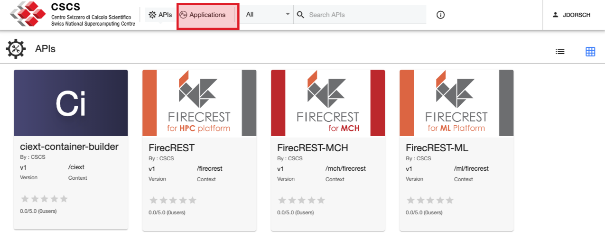
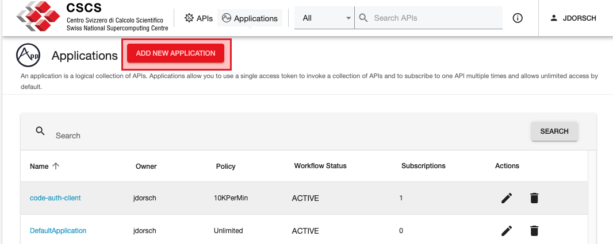
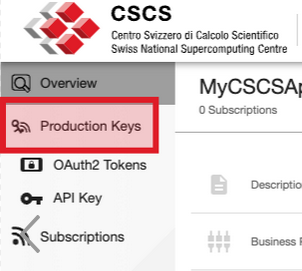
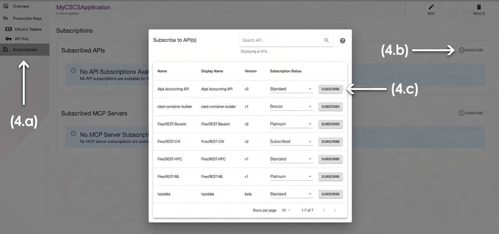

[](){#ref-alps-accounting-api}
# Alps Accounting API

The Alps Accounting API provides programmatic access to compute and storage consumption data for projects on the [Alps Research Infrastructure][ref-alps].
It is aimed at users, PIs and deputy PIs who want to retrieve usage records for reporting, monitoring or integration with external tools.

The API is hosted at `https://api.cscs.ch/alps-accounting/v2` and is documented with an [OpenAPI specification](https://api.cscs.ch/alps-accounting/v2/openapi.json).

## What you can retrieve

The API exposes two groups of endpoints:

* **Compute usage** — node-hours, CPU-hours, job count and other job-related metrics aggregated per day or per month.
* **Storage usage** — used space, quotas and inode counts for Capstor and Iopsstor file systems, aggregated per day or per month.

All consumption data is tied to a CSCS project (`account`).

## Who can access what

* Any user can query their own compute and storage consumption.
* **PIs and deputy PIs** can retrieve user-level consumption for all members of their projects.

Access is granted at the project level through the [Developer Portal][ref-devportal].

## Getting access

Subscribe to the Alps Accounting API in the [Developer Portal][ref-devportal]:

1. Sign in at [developer.cscs.ch](https://developer.cscs.ch).

1. On the [Developer Portal][ref-devportal] click on the tab "Applications" and "ADD NEW APPLICATION" to create a new [application][ref-devportal-application] (or reuse an existing one).



1. Generate the [production keys][ref-devportal] for the application.             


1. Subscribe the application to the **Alps Accounting API** and choose the desired version.

    (4.a) click on the :fontawesome-solid-rss: `Subscriptions` option on the left panel

    (4.b) click the :fontawesome-solid-circle-plus: `SUBSCRIBE` button

    (4.c) choose the [business plan][ref-devportal-api-info] and the version of the API you want to subscribe to by clicking the `SUBSCRIBE` button on the right-side of the requested API.


Keep the *Consumer Key* (client ID) and *Consumer Secret* (client secret) secure; they are credentials for accessing the API.

## Authentication

The API uses OAuth2 client credentials.
Exchange the client ID and secret for a short-lived Bearer token, then include the token in the `Authorization` header of every request.

```bash title="request an access token"
curl -s -X POST "https://auth.cscs.ch/auth/realms/firecrest-clients/protocol/openid-connect/token" \
  --data "grant_type=client_credentials" \
  --data "client_id=<CLIENT_ID>" \
  --data "client_secret=<CLIENT_SECRET>"
```

Use the returned `access_token` in subsequent requests:

```bash title="call the API with a Bearer token"
curl -s -X GET "https://api.cscs.ch/alps-accounting/v2/compute/usage/day?from=2025-01-01&to=2025-01-07" \
  -H "Authorization: Bearer <ACCESS_TOKEN>"
```

!!! warning
    Store client credentials and access tokens in a secure location such as a password manager or CI/CD secret store.
    Never commit them to repositories or expose them in logs.

## API endpoints

The base URL for all endpoints is `https://api.cscs.ch/alps-accounting/v2`.

### Compute usage

#### Daily compute usage

`GET /compute/usage/day`

Returns compute usage records aggregated per day for the requested date range.

| Parameter | Required | Description |
|-----------|----------|-------------|
| `from`    | yes      | Start date in `YYYY-MM-DD` format. |
| `to`      | yes      | End date in `YYYY-MM-DD` format. |
| `account` | no       | One or more project identifiers to filter by. |
| `username`| no       | One or more usernames to filter by. |
| `cluster` | no       | One or more cluster names to filter by. |

#### Monthly compute usage

`GET /compute/usage/month`

Returns compute usage records aggregated per month for the requested month range.

| Parameter | Required | Description |
|-----------|----------|-------------|
| `from`    | yes      | Start month in `YYYY-MM` format. |
| `to`      | yes      | End month in `YYYY-MM` format. |
| `account` | no       | One or more project identifiers to filter by. |
| `username`| no       | One or more usernames to filter by. |
| `cluster` | no       | One or more cluster names to filter by. |

### Storage usage

#### Daily storage usage

`GET /storage/usage/day`

Returns storage usage for the specified date.

| Parameter      | Required | Description |
|----------------|----------|-------------|
| `date`         | yes      | Date in `YYYY-MM-DD` format. |
| `account`      | no       | One or more project identifiers to filter by. |
| `customerName` | no       | One or more customer names to filter by. |
| `filesystemName`| no      | File system to filter by, e.g. `capstor` or `iopsstor`. |
| `dataType`     | no       | Storage category: `store`, `archive`, `user` or `scratch`. |
| `path`         | no       | One or more paths to filter by. |

#### Monthly storage usage

`GET /storage/usage/month`

Returns storage usage for the specified month.

| Parameter      | Required | Description |
|----------------|----------|-------------|
| `month`        | yes      | Month in `YYYY-MM` format. |
| `account`      | no       | One or more project identifiers to filter by. |
| `customerName` | no       | One or more customer names to filter by. |
| `filesystemName`| no      | File system to filter by, e.g. `capstor` or `iopsstor`. |
| `dataType`     | no       | Storage category: `store`, `archive`, `user` or `scratch`. Defaults to `store`. |
| `path`         | no       | One or more paths to filter by. |

## Examples

The examples below assume that the `ACCESS_TOKEN` environment variable contains a valid Bearer token.

### Query daily compute usage

=== "curl"

    ```console title="daily compute usage for a date range"
    $ curl -s -X GET "https://api.cscs.ch/alps-accounting/v2/compute/usage/day?from=2025-01-01&to=2025-01-07&account=g123" \
        -H "Authorization: Bearer $ACCESS_TOKEN" | jq
    {
      "compute": [
        {
          "id": 1,
          "username": "bobsmith",
          "updated": "2025-01-02T00:00:00Z",
          "userId": 12345,
          "account": "g123",
          "cluster": "clariden",
          "usageDate": "2025-01-01",
          "nodeHours": 12.0,
          "cpuHours": 48.0,
          "jobCount": 3,
          "totalElapsedTime": 43200,
          "totalNodeCount": 4
        }
      ]
    }
    ```

=== "python"

    ```python title="daily compute usage with requests"
    import requests

    url = "https://api.cscs.ch/alps-accounting/v2/compute/usage/day"
    headers = {"Authorization": f"Bearer {ACCESS_TOKEN}"}
    params = {
        "from": "2025-01-01",
        "to": "2025-01-07",
        "account": "g123",
    }

    response = requests.get(url, headers=headers, params=params)
    print(response.json())
    ```

### Query monthly compute usage

=== "curl"

    ```console title="monthly compute usage for a project"
    $ curl -s -X GET "https://api.cscs.ch/alps-accounting/v2/compute/usage/month?from=2025-01&to=2025-03&account=g123" \
        -H "Authorization: Bearer $ACCESS_TOKEN" | jq
    {
      "compute": [
        {
          "id": 1,
          "updated": "2025-02-01T00:00:00Z",
          "username": "bobsmith",
          "userId": 12345,
          "account": "g123",
          "cluster": "clariden",
          "usageDate": "2025-01-01",
          "nodeHours": 120.0,
          "cpuHours": 480.0,
          "jobCount": 30,
          "totalElapsedTime": 432000,
          "totalNodeCount": 40
        }
      ]
    }
    ```

=== "python"

    ```python title="monthly compute usage with requests"
    import requests

    url = "https://api.cscs.ch/alps-accounting/v2/compute/usage/month"
    headers = {"Authorization": f"Bearer {ACCESS_TOKEN}"}
    params = {
        "from": "2025-01",
        "to": "2025-03",
        "account": "g123",
    }

    response = requests.get(url, headers=headers, params=params)
    print(response.json())
    ```

### Query daily storage usage

=== "curl"

    ```console title="daily storage usage for a project"
    $ curl -s -X GET "https://api.cscs.ch/alps-accounting/v2/storage/usage/day?date=2025-01-01&account=g123&filesystemName=capstor&dataType=store" \
        -H "Authorization: Bearer $ACCESS_TOKEN" | jq
    {
      "storage": [
        {
          "id": 1,
          "updated": "2025-01-02T00:00:00Z",
          "spaceUsed": 1099511627776,
          "spaceCurrency": "B",
          "spaceHardQuota": 2199023255552,
          "spaceSoftQuota": 1975684956160,
          "inodesSoftQuota": 1000000,
          "inodesHardQuota": 1200000,
          "inodesUsed": 500000,
          "usageDate": "2025-01-01",
          "username": "bobsmith",
          "tenant": "cscs",
          "customerName": "acme",
          "account": "g123",
          "dataType": "store",
          "filesystemName": "capstor",
          "systemName": "capstor",
          "path": "/capstor/store/cscs/g123",
          "gid": 32819,
          "uid": 12345,
          "aggregationPeriod": "daily"
        }
      ]
    }
    ```

=== "python"

    ```python title="daily storage usage with requests"
    import requests

    url = "https://api.cscs.ch/alps-accounting/v2/storage/usage/day"
    headers = {"Authorization": f"Bearer {ACCESS_TOKEN}"}
    params = {
        "date": "2025-01-01",
        "account": "g123",
        "filesystemName": "capstor",
        "dataType": "store",
    }

    response = requests.get(url, headers=headers, params=params)
    print(response.json())
    ```

### Query monthly storage usage

=== "curl"

    ```console title="monthly storage usage for a project"
    $ curl -s -X GET "https://api.cscs.ch/alps-accounting/v2/storage/usage/month?month=2025-01&account=g123&filesystemName=iopsstor&dataType=scratch" \
        -H "Authorization: Bearer $ACCESS_TOKEN" | jq
    {
      "storage": [
        {
          "id": 1,
          "updated": "2025-02-01T00:00:00Z",
          "spaceUsed": 549755813888,
          "spaceCurrency": "B",
          "spaceHardQuota": 1099511627776,
          "spaceSoftQuota": 989560464998,
          "inodesSoftQuota": 500000,
          "inodesHardQuota": 600000,
          "inodesUsed": 250000,
          "usageDate": "2025-01-01",
          "username": "bobsmith",
          "tenant": "cscs",
          "customerName": "acme",
          "account": "g123",
          "dataType": "scratch",
          "filesystemName": "iopsstor",
          "systemName": "iopsstor",
          "path": "/iopsstor/scratch/cscs/g123",
          "gid": 32819,
          "uid": 12345,
          "aggregationPeriod": "monthly"
        }
      ]
    }
    ```

=== "python"

    ```python title="monthly storage usage with requests"
    import requests

    url = "https://api.cscs.ch/alps-accounting/v2/storage/usage/month"
    headers = {"Authorization": f"Bearer {ACCESS_TOKEN}"}
    params = {
        "month": "2025-01",
        "account": "g123",
        "filesystemName": "iopsstor",
        "dataType": "scratch",
    }

    response = requests.get(url, headers=headers, params=params)
    print(response.json())
    ```

## Response fields

### Compute usage response

Both daily and monthly endpoints return a `compute` array.
Each element contains:

| Field               | Type   | Description |
|---------------------|--------|-------------|
| `id`                | int    | Record identifier. |
| `username`          | string | User who consumed the resources. |
| `userId`            | int    | Internal user identifier. |
| `account`           | string | Project identifier. |
| `cluster`           | string | Cluster where the jobs ran. |
| `usageDate`         | string | Date or month of the aggregation (`YYYY-MM-DD` for daily, `YYYY-MM-01` for monthly). |
| `nodeHours`         | number | Total node-hours consumed. |
| `cpuHours`          | number | Total CPU-hours consumed. |
| `jobCount`          | int    | Number of jobs. |
| `totalElapsedTime`  | int    | Cumulative elapsed time in seconds. |
| `totalNodeCount`    | int    | Cumulative number of nodes used. |
| `updated`           | string | ISO 8601 timestamp of the last update. |

### Storage usage response

Both daily and monthly endpoints return a `storage` array.
Each element contains:

| Field             | Type    | Description |
|-------------------|---------|-------------|
| `id`              | int     | Record identifier. |
| `username`        | string  | User or project owner the record refers to. |
| `account`         | string  | Project identifier, when applicable. |
| `customerName`    | string  | Customer name. |
| `tenant`          | string  | Tenant identifier. |
| `filesystemName`  | string  | File system name, e.g. `capstor` or `iopsstor`. |
| `systemName`      | string  | System name. |
| `dataType`        | string  | Storage category: `store`, `archive`, `user` or `scratch`. |
| `path`            | string  | File system path. |
| `usageDate`       | string  | Date or month of the aggregation. |
| `spaceUsed`       | int     | Used space in bytes. |
| `spaceCurrency`   | string  | Unit of the space values, typically `B` for bytes. |
| `spaceHardQuota`  | int     | Hard quota in bytes. |
| `spaceSoftQuota`  | int     | Soft quota in bytes. |
| `inodesUsed`      | int     | Number of inodes used. |
| `inodesSoftQuota` | int     | Soft inode quota. |
| `inodesHardQuota` | int     | Hard inode quota. |
| `uid`             | int     | User identifier. |
| `gid`             | int     | Group identifier. |
| `aggregationPeriod`| string | Aggregation period, e.g. `daily` or `monthly`. |
| `updated`         | string  | ISO 8601 timestamp of the last update. |

## Further information

* [Developer Portal documentation][ref-devportal]
* [OpenAPI specification](https://api.cscs.ch/alps-accounting/v2/openapi.json)
