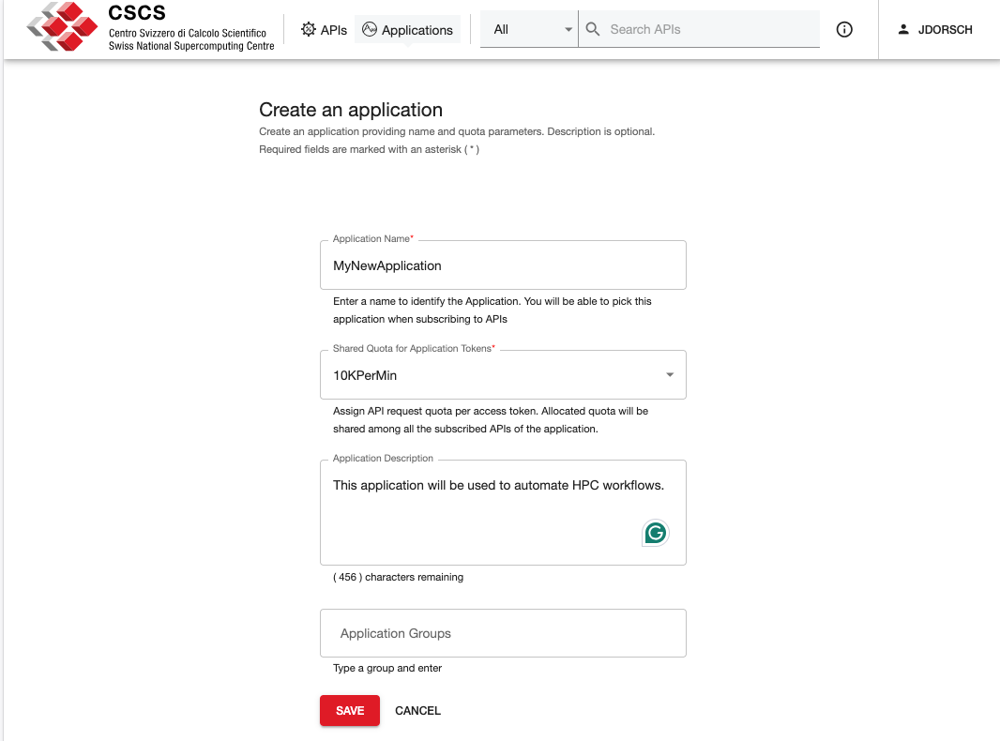
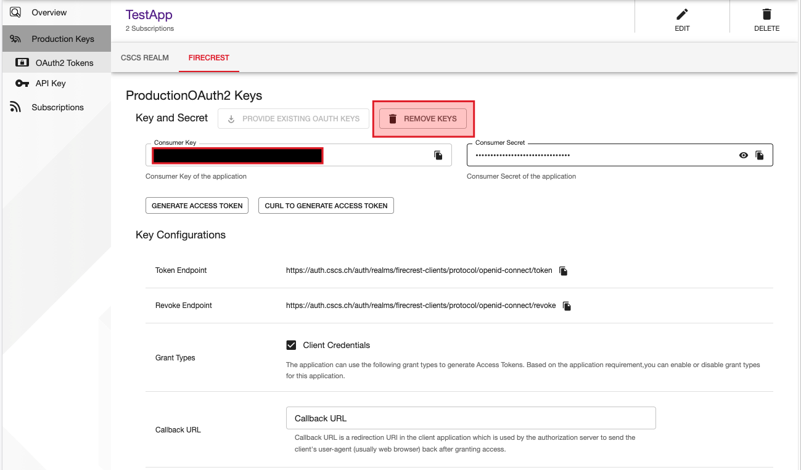

{#ref-devportal}
# Developer Portal

The [Developer Portal](https://developer.cscs.ch) facilitates CSCS users to manage client applications' subscriptions to an API at CSCS, such as [FirecREST][ref-firecrest] or [CI/CD][ref-cicd].

## Terminology

### API

An **API** is an interface exposed by CSCS to their users to allow them accessing protected resources (computing, storage, accounting data, etc.) in an automated fashion.

Examples of automated access to HPC resources are:

- A cronjob that triggers a CI/CD pipeline to test software periodically
- A workflow manager that executes workflows asynchronously
- A web application that performs unattended data transfer after a job finishes

{#ref-devportal-application}
### Application

An **application** (or "*client application*" or "*client*") is a software created by users that consumes the resources exposed by an API.

At CSCS, it requires [OIDC/OAuth2 access tokens](https://datatracker.ietf.org/doc/html/rfc6749#section-1.4) to authenticate against an [Identity Provider](#identity-provider-idp) (IdP) in order to access the protected resources.

An application *consumes* API resources by *subscribing* to the API. At CSCS, applications can be subscribed to multiple APIs.

### Identity Provider (IdP)

An **identity provider** is an entity that authenticates an application and allows accessing protected resources. In this case, CSCS provides an IdP for all its APIs.

### Production Keys

Applications must identify against the CSCS IdP. To do this, users must create the **production keys** (*Consumer ID* - or *Client ID* -, and *Consumer Secret* - or *Client Secret*) that are going to be used to authenticate.

!!! warning
    The pair Consumer Key and Secret represents a personal credential to access CSCS resources, therefore can't be shared and must be stored securely (i.e.: not exposed in public repositories, forums, documentation, etc)

## Getting started

Start by browsing to [developer.cscs.ch](https://developer.cscs.ch), then sign in by clicking the `SIGN-IN` button on the top right hand corner of the page.

Once logged in, you will see a list of APIs that are available to your user.

!!! warning
    You might not see version 1 or version 2 of some APIs. You will be able to see all the versions when you *subscribe* your Application to the API.

### Creating an Application

Click on the `Applications` option at the top of the screen to manage your applications.

To create a new application, click on the `ADD NEW APPLICATION` button at the top of the Applications view

Complete the mandatory fields (marked with `*`) and make sure to give the application a unique name and select the number of requests per minute.
When finished, click on the `SAVE` button.

!!! note
    On your first login you will find the `DefaultApplication` which is created by default

!!! note
    The quota of requests per minute will be shared by all subscribers to the Application over all APIs

### Configuring Production Keys

Once the Application is created, create the Production Keys by clicking on `Production Keys` in the left panel:

Click on the `Generate Keys` button at the bottom of the page to generate the production keys of your application:

Once the keys are generated, you will see the pair `Consumer Key` (also known as "client id") and `Consumer Secret` (also known as "client secret").

!!! note
    At the moment, only FIRECREST keys are available for the users

### Subscribe to an API

Once you have set up your Application, is time to subscribe it to an API.

To do so:

* (8.a) click on the :fontawesome-solid-rss: `Subscriptions` option on the left panel
* (8.b) click the :fontawesome-solid-circle-plus: `SUBSCRIBE APIS` button
* (8.c) choose the [business plan][ref-devportal-api-info] and the version of the API you want to subscribe to by clicking the `SUBSCRIBE` button on the right-side of the requested API.

## Manage your applications

Back on the Subscription Management page, you can review your active subscriptions and APIs that your Application has access to.

### Regenerate production keys

It's a good practice to rotate or regenerate the production keys of your application to increase security.

To do this, go to the `Production Keys` view of the desired application and click on the button `REMOVE KEYS`:

To regenerate the keys, refer back to the [Configuring Production Keys](#configuring-production-keys) section.

!!!info
    After resetting the credentials, you will need to reconfigure your software(s) to use the new keys

### Remove your application

To delete your application (which means removing all subscriptions and production keys), refer to the Application view and click on the `DELETE` button in the top-right corner:

{#ref-devportal-api-info}
## View information of APIs

The Developer Portal includes information of the APIs exposed by CSCS on the API view.

Click on `APIs` button on the top of the Developer Portal, and select on the left menu the option `Overview`

The information exposed in the overview view is:

* Amount of subscriptions to the API (among all clients)
* Documentation of the API (OpenAPI reference, SDK tools, etc)
* Community information (Public repository, slack channel)
* Contact information (developers and business)
* Business plans (amount of requests per minute that are allowed in the API subscription)
* Applications owned by the user that are subscribed to the API

### API Documents

Clicking in the left option `Documents` the user will be able to see the API reference with examples:

## Further Information

* [WSO2 Developer Portal](https://apim.docs.wso2.com/en/4.4.0/consume/consume-api-overview/)
* [Open ID Connect protocol (OIDC)](https://openid.net/developers/how-connect-works/)
* [JSON Web Tokens](https://www.jwt.io/introduction#what-is-json-web-token)
* [OpenAPI initiative](https://www.openapis.org/what-is-openapi)