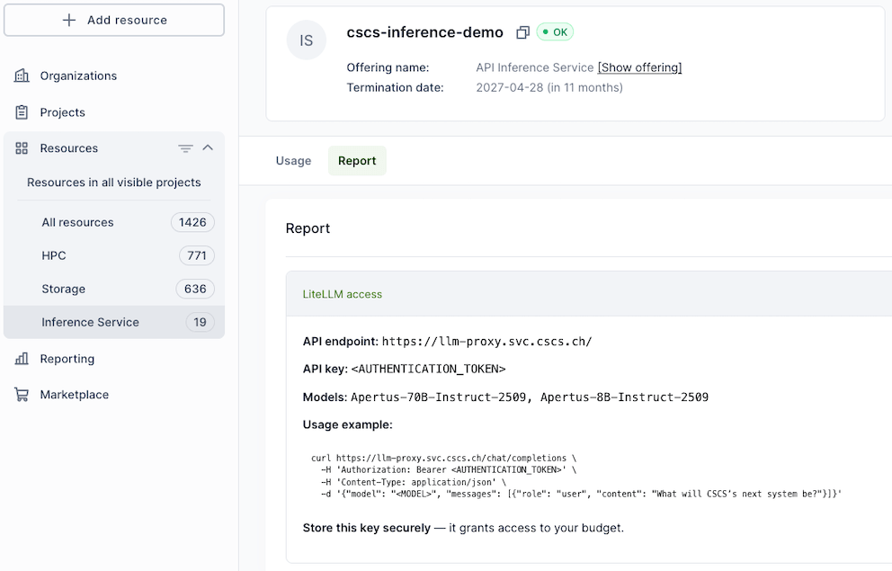

[](){#ref-inference-api}
# LLM Inference API Service

[](){#ref-inference-api-beta}
!!! under-construction "The LLM Inference API service is in early access"
    The service is under development, and is available by request to users who want to help CSCS build the service.

    During the beta we want to understand the following:

    * Single-site deployments vs. geo-redundant deployments for higher availability.
    * Usage patterns (e.g. scale-to-zero on inactivity, vs. keep warm with a minimum replica count).
    * Which models that should be offered, and under which conditions?
    * The trade-off between existing capacity and future cost.
    * What are the appropriate accounting metrics?

    During the beta users should expect that:

    * Capacity and availability is limited. Downtimes and slowdowns are to be expected.
    * The models that are available can change over time.
    * Access to the Beta is upon invitation, without any cost.

    Please contact Pablo Fernandez at [`pablo.fernandez@cscs.ch`](mailto:pablo.fernandez@cscs.ch) if you are interested to participate in the Beta, describing your use case, relevant project or organizational context, and an estimate of your expected requirements including load, preferred models, and availability expectations.

The LLM Inference API service provides Internet-accessible [OpenAI](https://developers.openai.com/api/docs)/[Anthropic](https://platform.claude.com/docs/en/api/overview)-compatible inference endpoints backed by selected open-weight LLM models such as [Apertus](https://apertvs.ai/) and other vetted models.
Users consume from a shared pool of models where requests are efficiently multiplexed across shared serving capacity, without needing to deploy, patch, scale, or operate the underlying serving stack.

Private model deployment is not supported.
If you are interested to deploy a model that is not available in this service, we encourage using the [sml tool](https://github.com/swiss-ai/model-launch) developed by the Swiss AI community.

Usage of sensitive or personal data is not allowed.
For privacy reasons, CSCS does not track user prompts or model responses.
However, CSCS collects infrastructure metrics and telemetry, including prompt and response lengths, in order to monitor the service quality.


## Service at a glance

<div class="grid cards" markdown>

* :material-api: **Managed endpoints**

  Standard API access over HTTPS using familiar client libraries and tooling.

* :material-robot-outline: **Curated models**

  Selected models are made available and updated centrally.

* :material-cloud-check: **No infrastructure management**

  Let CSCS manage GPUs, containers, autoscaling, and model servers.

* :material-shield-lock: **Sovereign and private**

  Your data is yours and is processed entirely within CSCS in Switzerland.
  Prompts and responses are not tracked.

</div>

[](){#ref-inference-api-quickstart}
## Quick Start

Before using the API, obtain a key by following the [access guide][ref-inference-api-access].
Include this API Key in every API request.

Query available models using the `/models` endpoint:
```bash
curl -X GET "https://api.inference.cscs.ch/v1/models" \
  -H "Authorization: Bearer <API_KEY>" \
  -H "Content-Type: application/json"
```

To get a response using the Apertus 70B model do (piped into `jq` for pretty output):
```console
$ curl -X POST "https://api.inference.cscs.ch/v1/chat/completions" \
    -H "Authorization: Bearer <API_KEY>" \
    -H "Content-Type: application/json" \
    -d '{
      "model": "swiss-ai/Apertus-70B-Instruct-2509",
      "messages": [
        {"role": "user", "content": "Explain gradient descent in one paragraph."}
      ],
      "temperature": 0.2
    }' | jq

```
```console
{
  "id": "chatcmpl-426afafa-2bfb-4412-a1cb-859fdc3ada0c",
  "object": "chat.completion",
  "created": 1782485315,
  "model": "swiss-ai/Apertus-70B-Instruct-2509",
  "choices": [
    {
      "index": 0,
      "message": {
        "role": "assistant",
        "content": "Gradient descent is a fundamental optimization algorithm used in machine learning to minimize the cost or loss function of a model. It works by iteratively adjusting the model's parameters in the direction of steepest descent of the cost function, which is determined by the negative of the gradient of the cost function with respect to the parameters. The gradient points in the direction of the greatest increase of the function, so by moving in the opposite direction (negative gradient), the algorithm reduces the cost. The step size, or learning rate, determines how much to adjust the parameters in each iteration. If the learning rate is too small, the algorithm may take too long to converge; if it's too large, the algorithm may overshoot the minimum and fail to converge. Gradient descent is widely used in training neural networks and other machine learning models.",
        "refusal": null,
        "annotations": null,
        "audio": null,
        "function_call": null,
        "tool_calls": [],
        "reasoning": null
      },
      "logprobs": null,
      "finish_reason": "stop",
      "stop_reason": null,
      "token_ids": null,
      "routed_experts": null
    }
  ],
  "service_tier": null,
  "system_fingerprint": "vllm-0.23.0-tp4-712aba24",
  "usage": {
    "prompt_tokens": 69,
    "total_tokens": 233,
    "completion_tokens": 164,
    "prompt_tokens_details": null
  },
  "prompt_logprobs": null,
  "prompt_token_ids": null,
  "prompt_text": null,
  "kv_transfer_params": null
}
```

[](){#ref-inference-api-access}
## Access

### Request access

Early access to this service requires an invitation.
If you would like to participate, please contact Pablo Fernandez ([`pablo.fernandez@cscs.ch`](mailto:pablo.fernandez@cscs.ch)) describing your use case, relevant project or organizational context, and an estimate of your expected requirements including load, preferred models, and availability expectations.

### Obtain your authentication token

Approved projects receive an authentication token, which can be retrieved and managed through the [project management portal][ref-account-waldur].
The token can be accessed by selecting "Inference Service" under "Resources" on the left side bar menu on the portal, as demonstrated in the image below:



## API

The service is accessed through the gateway base URL `https://api.inference.cscs.ch`, and support standard endpoints, such as:

| Path | Purpose |
| ---- | ------- |
| `/v1/models`           | Query available models |
| `/v1/chat/completions` | Chat completions |
| `/v1/embeddings`       | Get a vector representation of a given input |

!!! todo
    Describe API support.
    If we provide both OpenAI and Anthropic APIs, is it sufficient to provide links to external documentation for these APIs, with notes about any differences?

[](){#ref-inference-api-guides}
## Guides

### Setting up coding agents to use the inference service

Below are instructions for setting up [Claude Code](https://claude.com/product/claude-code) and [OpenCode](https://opencode.ai).
For more details and for other agents, see their respective documentation pages.

!!! info
    Both agent frameworks can be launched inside a loaded [uenv][ref-uenv] or [container][ref-container-engine], which will allow the agents to build and run your project.

!!! warning
    The agents will have access to to your files and are able to submit jobs on behalf of you.
    This has to be handled very carefully; as a user you are responsible for the actions of the agents that you launch.
    Compute resources used by agent-launched Slurm jobs will be billed towards your project account.

#### Claude Code

Set the following environment variables before starting a `claude` session.

```bash
export ANTHROPIC_API_KEY=<API_KEY>
export ANTHROPIC_BASE_URL=https://api.inference.cscs.ch/v1
export ANTHROPIC_MODEL=moonshotai/Kimi-K2.7-Code
claude
```

#### OpenCode

Add a custom provider to your OpenCode config file (typically `~/.config/opencode/opencode.json`).

```json title="configure opencode for the cscs llm inference api"
{
  "$schema": "https://opencode.ai/config.json",
  "provider": {
    "cscs": {
      "npm": "@ai-sdk/openai-compatible",
      "name": "CSCS Inference",
      "options": {
        "baseURL": "https://api.inference.cscs.ch/v1"
      },
      "models": {
        "moonshotai/Kimi-K2.7-Code": {
          "name": "Kimi K2.7-Code"
        }
      }
    }
  }
}
```

Start OpenCode and run the `/connect` command.
Select "CSCS Inference" to choose the newly added provider, and enter your API key when prompted.
Once connected, you can choose models configured in the config.

!!! info
    OpenCode does not auto-discover available models.
    Models have to be explicitly configured in the config.

### Reducing consumption

* Longer prompts increase cost and latency
* Future costs may differentiate across models with different computational load

[](){#ref-inference-api-issues}
## Known issues and limitations

* Project key management is still evolving; currently one key is issued per project and rotation requires contacting the team.
* Detailed self-service telemetry is limited today.
* Documentation and model-specific configuration transparency are work in progress.
* Load balancing and other QoS need to be understood.

