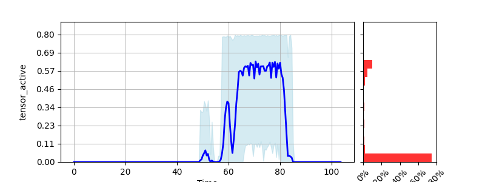
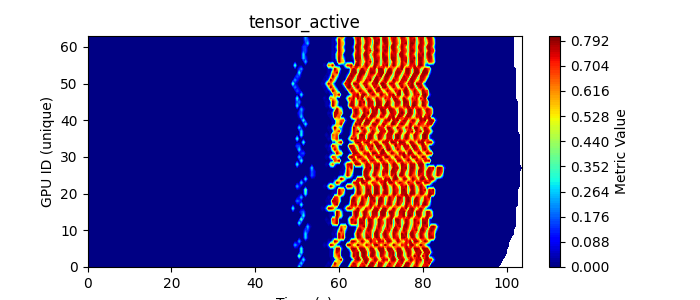

{#ref-gssr-overview}
# gssr 

GPU Saturation Scorer (gssr) provides a simple way to profile your code and get the results in both tables and plots for easy visualisation. gssr works on top of [NVIDIA Data Center GPU Manager (DCGM)](https://developer.nvidia.com/dcgm) and thus only NVIDIA GPUs are currently supported. 

The following documentations will be available.:

* [Quickstart Guide][ref-gssr-quickstart]
* [Container Guide][ref-gssr-containers]

This tool will produce time-series and heatmaps of the profiled metric values. Here is an example of one set of plots generated by the tool from the application Megatron-LLM from EPFL. 

