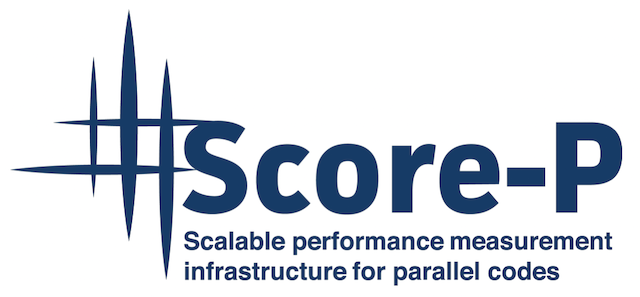
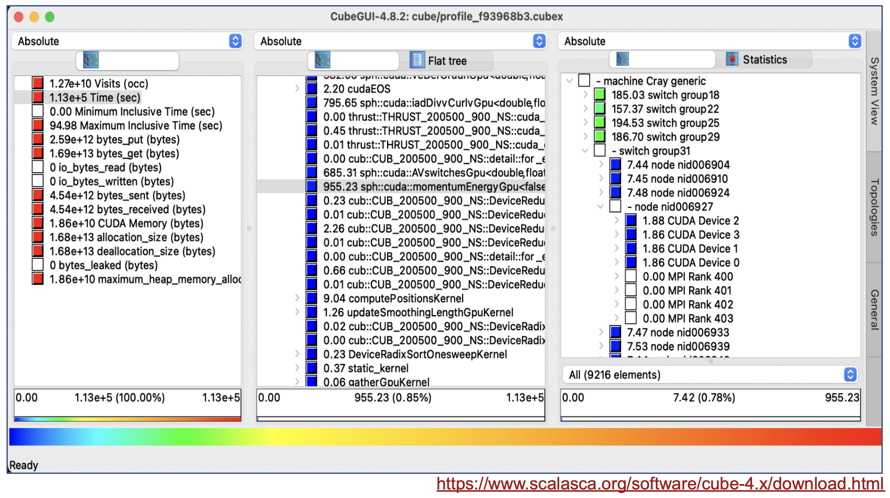
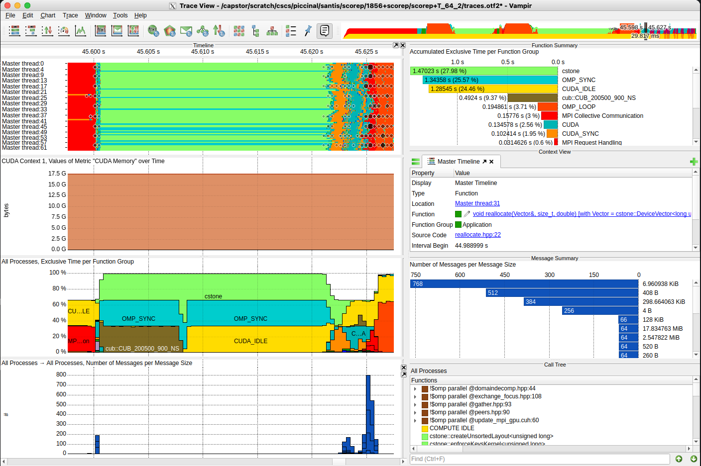

[](){#ref-devtools-vihps}
# VI-HPS tools

The [VI-HPS](https://www.vi-hps.org/tools) Institute (Virtual Institute for High Productivity Supercomputing) provides tools that can assist developers of simulation codes to address their needs in performance analysis.

## [Score-P](https://www.vi-hps.org/projects/score-p/overview/overview.html)

{ width="5%"}
is a highly scalable instrumentation and measurement infrastructure for profiling, event tracing, and online analysis. It supports a wide range of HPC platforms and programming models. Score-P provides core measurement services for a range of specialized analysis tools, such as Vampir, Scalasca and others.

## [Vampir](https://www.vi-hps.org/tools/vampir.html) 

{ width="5%"}
is a performance visualizer that allows to quickly study the program runtime behavior at a fine level of details. This includes the display of detailed performance event recordings over time in timelines and aggregated profiles. Interactive navigation and zooming are the key features of the tool, which help to quickly identify inefficient or faulty parts of a program.

!!! info
    While Score-P does not require a license, [Vampir](https://vampir.eu/licensing) does. CSCS standard license allows to read trace files with up to 256 concurrent threads of execution.

    The Vampir GUI is currently available only on `x86-64` CPU based systems and is not provided via a uenv (more details in the Quickstart guide below).
    You can use Score-P to generate OTF2 traces files on Alps compute nodes and then visualize the results with Vampir on a x86-64 CPU based system (for instance Eiger, LUMI or your own license). 

## [Cube and Scalasca](http://www.vi-hps.org/tools/scalasca.html)

{ width="5%"}
 support  the performance optimization of parallel programs with a collection of scalable trace-based tools for in-depth analyses of concurrent behavior. The analysis identifies potential performance bottlenecks - in particular those concerning communication and synchronization - and offers guidance in exploring their causes.

## Quickstart guide

The VI-HPS uenv is named `scorep` and it can be loaded into your environment as explained here and in the [uenv documentation][ref-uenv].

??? example "Finding and pulling available `scorep` versions"

    ```bash
    uenv image find scorep
    # uenv                 arch   system  id                 size(MB) date
    # scorep/9.2-gcc12:v1  gh200  daint   bfd3b46d30404f2c   7,602    2025-07-14
    # scorep/9.2-gcc13:v1  gh200  daint   3c0357a490c81f32   7,642    2025-07-14

    uenv image pull scorep/9.2-gcc13:v1
    # pulling 3c0357a490c81f32 100.00%
    ```    

    This uenv is configured to be mounted in the `/user-environment` path.

??? example "Start the `scorep` uenv"

    ```bash
    uenv start scorep/9.2-gcc13:v1 -v default
    
    uenv status # (1)!
    scorep --version # 9.2
    scalasca --version # 2.6.2
    cubelib-config --version # 4.9
    otf2-print --version # 3.1.1
    
    find /user-environment/ -name scorep.pdf # (2)!
    ```
    
    1. Test that everything has been mounted correctly and that the tools are in the PATH
    2. A PDF version of the user guide is available in the uenv.

??? example "Recompile your code with `scorep` on Alps"

    ```bash
    # Building with CMake requires the following steps
    ## Invoke cmake with the scorep wrapper disabled:
    SCOREP_WRAPPER=OFF \
        cmake -S src -B build \
        -DCMAKE_CXX_COMPILER=scorep-mpic++ \
        -DCMAKE_C_COMPILER=scorep-mpicc \
        -DCMAKE_CUDA_COMPILER=scorep-nvcc \
        -DCMAKE_CUDA_ARCHITECTURES=90 # [...]

    ## Then build with the scorep wrapper enabled:
    SCOREP_WRAPPER=ON \
        cmake --build build
    ```

??? example "Run your application with `scorep` on Alps"

    Pick one of the report type in your jobscript before running the executable compiled with `scorep`:
    
    === "Profiling"

        - Profiling gives an overview of the performance of your simulation on Alps
    
        ```bash
        export SCOREP_ENABLE_PROFILING=true
        # Call-path profiling: CUBE4 data format (profile.cubex)
        ```

        - Then run your job as usual with `srun` or `sbatch` on Alps,
        - Copy the generated profile `profile.cubex` to your laptop,
        - Install the [Cube](https://www.scalasca.org/scalasca/software) tool on your laptop,
        - Analyze the results with the GUI:
            - performance metric (left panel)
            - call path (middle panel)
            - system resource (right panel)

        ```bash
        /Applications/Cube/4.9/Cube.app/Contents/MacOS/maccubegui.sh \
        ./profile.cubex
        ```    

        { width="90%"}
    
    === "Tracing"

        - Tracing allows a detailed analysis of the performance of your simulation on Alps
    
        ```bash
        export SCOREP_ENABLE_TRACING=true
        # Event-based tracing: OTF2 data format (traces.otf2)
        ```

        - Then run your job as usual with `srun` or `sbatch` on Alps,
        - Analyze the results with the GUI:

        ```bash
        ssh -X eiger.cscs.ch  # Vampir GUI requires x86_64 ⚠️
        /capstor/store/cscs/userlab/vampir/10.6.1/bin/vampir \
        ./traces.otf2
        ```

        !!! info
        - Tracing allows more detailed analysis but will also make your simulation run longer than with profiling,
        - `scorep-score` allows to estimate the size of an OTF2 tracefile from a CUBE profile,
          it can also help to reduce the overhead of tracing via filtering:

        ```bash
        scorep-score -g profile.cubex # generate filter file
        scorep-score -f initial_scorep.filter profile.cubex
        export SCOREP_FILTERING_FILE='initial_scorep.filter'
        ```

        The [user guide](https://perftools.pages.jsc.fz-juelich.de/cicd/scorep/tags/scorep-9.2/html/group__SCOREP__User.html#gaab4b3ccc2b169320c1d3bf7fe19165f9) provides more details about how to reduce overhead.

        { width="90%"}
