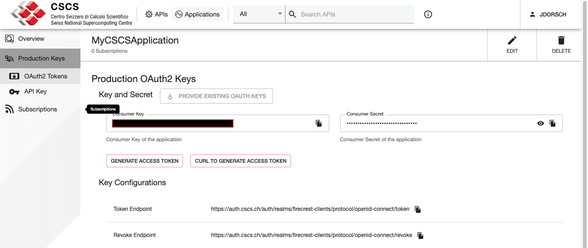
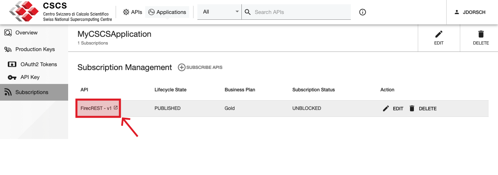

# FirecREST

FirecREST is a RESTful API for managing High-Performance Computing resources, developed at CSCS.
Scientific platform developers can integrate Firecrest into web-enabled portals and applications, allowing them to securely access authenticated and authorized CSCS services such as job submission and data transfer on HPC systems.

Users can make HTTP requests to perform the following operations:

* basic system utilities like `ls`, `mkdir`, `mv`, `chmod`, `chown`, among others
* actions against the Slurm workload manager (submit, query, and cancel jobs of the user)
* internal (between CSCS systems) and external (to/from CSCS systems) data transfers

For a full feature set, have a look at the latest [FirecREST API specification](https://firecrest-docs.v1.svc.cscs.ch/) deployed at CSCS.

Please refer to the [FirecREST documentation](https://firecrest.readthedocs.io/en/latest/) for detailed documentation.

## FirecREST Deployment on Alps

FirecREST is available for all three major [Alps platforms][ref-alps-platforms], with a different API endpoint for each platform.

| Platform | API Endpoint | Clusters |
|----------|-------------|-----------|
| HPC Platform | https://api.cscs.ch/hpc/firecrest/v1 | [Daint][ref-cluster-daint], [Eiger][ref-cluster-eiger] |
| ML Platform | https://api.cscs.ch/ml/firecrest/v1 | [Bristen][ref-cluster-bristen], [Clariden][ref-cluster-clariden] |
| CW Platform | https://api.cscs.ch/cw/firecrest/v1 | [Santis][ref-cluster-santis] |

## Developer Portal: Creating FirecREST clients

The [Developer Portal](https://developer.cscs.ch) is an application based on [WSO2 API Manager](https://wso2.com/api-manager/) that facilitates CSCS Users to manage subscriptions to an API at CSCS (such as FirecREST).

Start by navigating to [developer.cscs.ch](https://developer.cscs.ch), then sign in by clicking the "SIGN-IN" button on the top right hand corner of the page.

Once logged in, you will see a list of APIs that are available to your user.

### Creating an Application

Click on the "Applications" button at the top of the screen to manage your Applications.


To create a new application, click on the "ADD NEW APPLICATION" button at the top of the Applications page, and complete the mandatory fields (marked with `*`).
Make sure to give the application a unique name and select the number of requests per minute.
When finished, click on the "Save" button.

!!! note
    To subscribe to an API you need at least one application, for which it is possible to use the DefaultApplication.

!!! note
    The quota of requests per minute will be shared by all subscribers to the Application over all APIs.

### Configuring Production Keys


Once the Application is created, create the Production Keys (Client ID and Client Secret) by clicking on "Production Keys" 


There are two ways to configuring production keys:

=== "use existing OAuth keys"

    This approach can be used if you have already generated keys for FirecREST.

    * click on the "Provide Existing OAuth Keys" button
    * enter the Consumer Key (Client ID) and Consumer Secret (Client Secret)
    * click the "Provide" button to confirm

    

=== "generate new OAuth keys"

    Use this if this is your first FirecREST application, or if you wish to create new keys.

    * click on the "Generate Keys" button at the bottom of the page

    

Once the keys are generated, you will see the pair "Consumer Key" and "Consumer Secret".



!!! warning
    Store this pair of credentials securely, these are the access keys to your resources at CSCS.

### Subscribe to an API

Once you have set up your Application, is time to subscribe it to an API.

To do so:

* (8a) click on the "Subscriptions" option on the left panel
* (8b) click the :fontawesome-solid-circle-plus: "Subscribe APIS" button
* (8c) choose the API you want to subscribe to by clicking the "Subscribe" button


Back on the Subscription Management page, you can review your active subscriptions and APIs that your Application has access to.



To use your Application to access FirecREST, follow the [API documentation](https://firecrest-docs.v1.svc.cscs.ch/).

## Getting Started

### Using the Python Interface

One way to get started is by using [pyFirecREST](https://pyfirecrest.readthedocs.io/), a Python package with a collection of wrappers for the different functionalities of FirecREST.
This package simplifies the usage of FirecREST by making multiple requests in the background for more complex workflows as well as by refreshing the access token before it expires.


!!! example "Try FirecREST using pyFirecREST"
    ```python
    import firecrest as fc


    client_id = <client_id>
    client_secret = <client_secret>
    token_uri = "https://auth.cscs.ch/auth/realms/firecrest-clients/protocol/openid-connect/token"

    # Setup the client for the specific account
    # For instance, for the Alps HPC Platform system Daint:

    client = fc.Firecrest(
        firecrest_url="https://api.cscs.ch/hpc/firecrest/v1",
        authorization=fc.ClientCredentialsAuth(client_id, client_secret, token_uri)
    )

    print(client.all_systems())
    # Output: (one dictionary per system)
    # [{
    #      'system': 'daint'
    #      'status': 'available',
    #      'description': 'System ready',
    #  }]

    print(client.list_files('daint', '/capstor/scratch/cscs/<username>'))
    # Example output: (one dictionary per file)
    # [{
    #      'name': 'file.txt',
    #      'user': 'username'
    #      'last_modified': '2024-04-28T12:03:33',
    #      'permissions': 'rw-r--r--',
    #      'size': '2021',
    #      'type': '-',
    #      'group': 'project',
    #      'link_target': '',
    #  },
    #  {
    #       'name': 'test-dir',
    #       'user': 'username'
    #       'last_modified': '2024-04-20T11:22:41',
    #       'permissions': 'rwxr-xr-x',
    #       'size': '4096',
    #       'type': 'd',
    #       'group': 'project',
    #       'link_target': '',
    #  }]
    ```

The tutorial is written for a generic instance of FirecREST but if you have a valid user at CSCS you can test it directly with your resource allocation on the exposed systems.

### CSCS Developer Portal

A client application that makes requests to FirecREST will not be using directly the credentials of the user for the authentication, but an access token instead. The access token is a signed JSON Web Token (JWT) which contains expiry information. Behind the API, all commands launched by the client will use the account of the user that registered the client, inheriting their access rights. You can manage your client application on the CSCS Developer Portal.

Every client will have a client ID (Consumer Key) and a secret (Consumer Secret) that will be used to get a short-lived access token with an HTTP request.

!!! example "curl call to fetch the access token"
    ```
    curl -s -X POST https://auth.cscs.ch/auth/realms/firecrest-clients/protocol/openid-connect/token \
         --data "grant_type=client_credentials" \
         --data "client_id=<your_client>" \
         --data "client_secret=<your_secret>"
    ```

### Downloading Large Files

A staging area is used for external transfers and downloading/uploading a file from/to a CSCS filesystem.

Please follow the steps below to download a file:

1. Request FirecREST to move the file to the staging area: a download link will be provided
2. The file will remain in the staging area for 7 days or until the link gets invalidated with a request to the [`/storage/xfer-external/invalidate`](https://firecrest.readthedocs.io/en/latest/reference.html#post--storage-xfer-external-invalidate) endpoint or through the pyfirecrest method
3. The staging area is common for all users, therefore users should invalidate the link as soon as the download has been completed

You can see the full process in this [tutorial](https://firecrest.readthedocs.io/en/latest/tutorial.html#upload-with-non-blocking-call-something-bigger).

We may be forced to delete older files sooner than 7 days whenever large files are moved to the staging area and the link is not invalidated after the download, to avoid issues for other users: we will contact the user in this case.

When uploading files through the staging area, you don't need to invalidate the link. FirecREST will do it automatically as soon as it transfers the file to the filesystem of CSCS.

There is also a constraint on the size of a single file to transfer externally to our systems via FirecREST: 5 GB.

If you wish to transfer data bigger than the limit mentioned above, you can check the [compress](https://firecrest.readthedocs.io/en/latest/reference.html#post--storage-xfer-internal-compress) and [extract](https://firecrest.readthedocs.io/en/latest/reference.html#post--storage-xfer-internal-extract) endpoints or follow the following [example on how to split large files](https://github.com/eth-cscs/firecrest/blob/master/examples/download-large-files/README.md) and download/upload them using FirecREST.

The limit on the time and size of files that can be download/uploaded via FirecREST might change if needed.

!!! example "checking the current values in the parameters endpoint"
    ```python
    >>> print(json.dumps(client.parameters(), indent = 2))
    {
      (...)

      "storage": [
        {
          "description": "Type of object storage, like `swift`, `s3v2` or `s3v4`.",
          "name": "OBJECT_STORAGE",
          "unit": "",
          "value": "s3v4"
        },
        {
          "description": "Expiration time for temp URLs.",
          "name": "STORAGE_TEMPURL_EXP_TIME",
          "unit": "seconds",
          "value": "604800"  ## <-------- 7 days
        },
        {
          "description": "Maximum file size for temp URLs.",
          "name": "STORAGE_MAX_FILE_SIZE",
          "unit": "MB",
          "value": "5120"   ## <--------- 5 GB
        }
      (...)
    }
    ```
### Job Submission to the Workload Manager through FirecREST

FirecREST provides an abstraction for job submission using in the backend the SLURM scheduler of the vCluster (in the case of CSCS).

When submitting a job via the different [endpoints](https://firecrest.readthedocs.io/en/latest/reference.html#compute), you should pass the `-l` option to the `/bin/bash` command on the batch file.

This option ensures that the job submitted uses the same environment as your login shell to access the system-wide profile (`/etc/profile`) or to your profile (in files like `~/.bash_profile`, `~/.bash_login`, or `~/.profile`).

## Further Information

* [Full list of FirecREST calls](https://firecrest.readthedocs.io/en/latest/reference.html)
* [Documentation of FirecREST](https://firecrest.readthedocs.io/)
* [Documentation of pyFirecREST](https://pyfirecrest.readthedocs.io/)
* [Demo FirecREST environment in Git](https://github.com/eth-cscs/firecrest/tree/master/deploy/demo)
* [www.oauth.com](https://www.oauth.com)
* [Python Requests](https://requests.readthedocs.io/en/master/user/quickstart)
